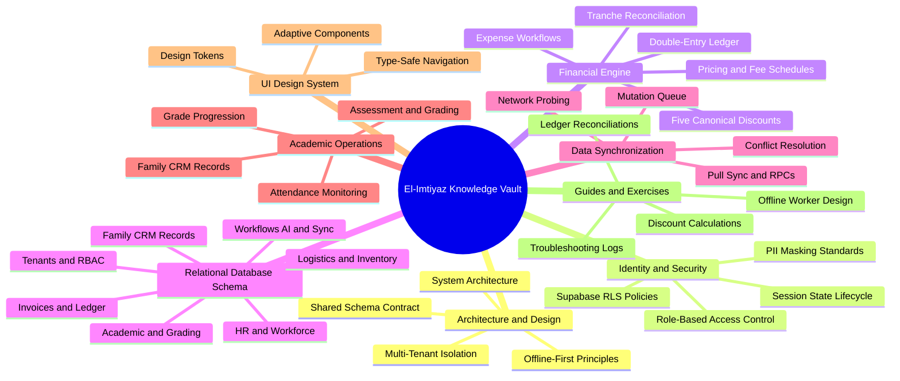

# 00. Home and Master Map of Content (MOC)

#knowledge-base #moc #el-imtiyaz #architecture #android #offline-first

Welcome to the comprehensive, deeply hierarchical knowledge base for the **El-Imtiyaz School Management Platform & Android Mobile System**. This Obsidian vault serves as the authoritative, exhaustive technical reference, domain manual, architectural blueprint, and interactive learning curriculum.

---

## 1. Vault Knowledge Mind Map



---

## 2. Vault Hierarchy and Course Map

```
El-Imtiyaz School Management System : {
    Chapter 1: Course Overview and Architecture
        - [[01. Master Architecture MOC]]
        - [[01.1 System Architecture Overview]]
        - [[01.2 Offline-First Design Principles]]
        - [[01.3 Multi-Tenant Isolation Strategy]]
        - [[01.4 Mobile vs Desktop Shared Schema Contract]]

    Chapter 2: Identity, Authentication, and Security
        - [[02. Master Security and Auth MOC]]
        - [[02.1 Role-Based Access Control Engine]]
        - [[02.2 Session State and Token Refresh Lifecycle]]
        - [[02.3 Supabase Authentication and RLS Policies]]
        - [[02.4 PII Masking and Privacy Enforcement]]

    Chapter 3: Financial Engine and School Accounting
        - [[03. Master Financial Engine MOC]]
        - [[03.1 Algerian School Pricing and Fee Schedules]]
        - [[03.2 Five Canonical Discount Calculations]]
        - [[03.3 Double-Entry Ledger Engine and Invariants]]
        - [[03.4 Installment Tranche Scheduling and Reconciliation]]
        - [[03.5 Cash Counter and Expense Workflows]]

    Chapter 4: Data Synchronization and Offline Queue
        - [[04. Master Sync Engine MOC]]
        - [[04.1 Pull Sync and PostgREST RPC Synchronization]]
        - [[04.2 Push Mutation Queue and Idempotency Keys]]
        - [[04.3 Conflict Resolution and Last-Write-Wins]]
        - [[04.4 Network State Detection and WorkManager Policies]]

    Chapter 5: Academic Management and Operations
        - [[05. Master Academic Operations MOC]]
        - [[05.1 Student and Parent Family CRM]]
        - [[05.2 Class and Grade Level Progression]]
        - [[05.3 Attendance Tracking and Unexcused Absences]]
        - [[05.4 Assessment, Grading, and Report Generation]]

    Chapter 6: Mobile UI and Jetpack Compose Design System
        - [[06. Master UI Design System MOC]]
        - [[06.1 Design Tokens and CompositionLocals]]
        - [[06.2 Navigation Compose and Type-Safe Routing]]
        - [[06.3 Adaptive Layouts and Touch Target Compliance]]

    Chapter 7: Troubleshooting, Exercises, and Student Guide
        - [[07. Master Guide and Exercises MOC]]
        - [[07.1 Common Pitfalls and Memory Driver Warnings]]
        - [[07.2 Exercise 1 - Calculating Sibling and Palier Discounts]]
        - [[07.3 Exercise 2 - Reconciling Double-Entry Ledger Imbalances]]
        - [[07.4 Exercise 3 - Building an Offline-First Sync Worker]]

    Chapter 8: Relational Database Schema and Data Models
        - [[08. Master Database Schema MOC]]
        - [[08.1 Core Multi-Tenancy, Users, and RBAC Schema]]
        - [[08.2 Academic Structure, Classes, and Grading Schema]]
        - [[08.3 CRM, Students, and Family Relationships Schema]]
        - [[08.4 Financial Engine, Tariffs, Invoices, and Ledger Schema]]
        - [[08.5 HR, Workforce Attendance, Releve, and Shifts Schema]]
        - [[08.6 Logistics, Inventory, Procurement, and Suppliers Schema]]
        - [[08.7 Tasks, Workflows, Chat, AI, and System Infrastructure Schema]]
}
```

---

## 3. How to Navigate This Knowledge Base

1. **Top-Down Exploration**: Start at each chapter's **Master Map of Content (MOC)** for contextual orientation and learning pathways.
2. **Bottom-Up Concept Drilling**: Follow bidirectional `[[Wiki Links]]` inside atomic notes to explore foundational logic, database schemas, algebraic definitions, and code patterns.
3. **Hands-on Mastery**: Jump to [[07. Master Guide and Exercises MOC]] for detailed, step-by-step mathematical, architectural, and coding problems complete with solution explanations, tips, tricks, and student traps to avoid.
