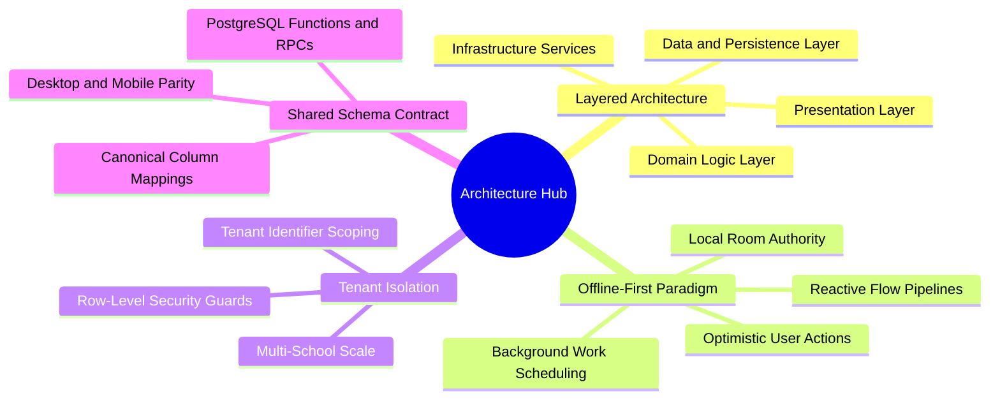

# 01. Master Architecture Map of Content (MOC)

#architecture #moc #chapter1 #offline-first #clean-architecture

This hub organizes the foundational structural principles, architectural paradigms, multi-tier execution models, and data contract specifications that govern the entire El-Imtiyaz software ecosystem.

---

## 1. Chapter Architecture Mind Map

---

## 2. Topic Exploration Pathways

- **System Architecture**: Study [[01.1 System Architecture Overview]] for the 3-tier presentation, domain, and data layers built with Kotlin Clean Architecture and Jetpack Compose.
- **Offline-First Mechanics**: Review [[01.2 Offline-First Design Principles]] to understand why local SQLite/Room is treated as the primary source of truth, eliminating network latency and dead-end spinners.
- **Multi-Tenancy**: Read [[01.3 Multi-Tenant Isolation Strategy]] to understand how data partitions (`tenant_id`) prevent accidental leaks between distinct school entities.
- **Cross-Platform Integration**: Explore [[01.4 Mobile vs Desktop Shared Schema Contract]] for details on PostgreSQL migrations (0027, 0028) ensuring 100% interoperability with desktop imports.

---

## 3. Core Architectural Rules

1. **Unidirectional Data Flow (UDF)**: UI states flow downwards from ViewModels as immutable Kotlin `StateFlow`, and events bubble upwards via distinct lambda callbacks.
2. **Offline Supremacy**: The user must never be blocked by an ongoing HTTP request or network glitch. All read operations observe the local Room database, and write operations commit locally before queueing background sync mutations.
3. **Strict Domain Isolation**: Domain entities (e.g., `Parent`, `Student`, `Payment`) have zero dependencies on Android framework classes, Room annotations, or Supabase SDK classes.
