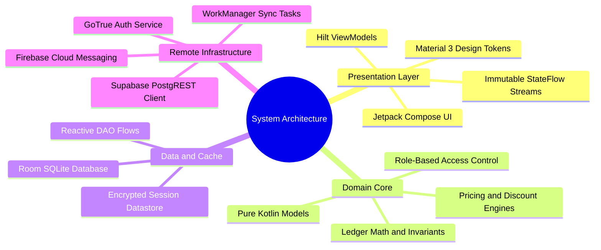

# 01.1 System Architecture Overview

#architecture #clean-architecture #jetpack-compose #android #kotlin

The El-Imtiyaz system is designed following strict **Clean Architecture** and **Modern Android Architecture (MVVM with Unidirectional Data Flow)** principles. It completely decouples presentation components, business rules, persistence engines, and external cloud APIs.

---

## 1. Architectural Knowledge Mind Map



---

## 2. The Three-Tier Architecture

### 2.1 Presentation Layer
- **Jetpack Compose Screens**: Declarative UI components that react strictly to emitted state objects. Zero imperative DOM or layout mutation.
- **ViewModels (`@HiltViewModel`)**: Manage UI state machines using Kotlin coroutines and `MutableStateFlow`. ViewModels expose read-only `StateFlow<UiState>` to the Composables.
- **Design System Tokens**: Centralized theming via `ElColors`, `ElSpacing`, `ElElevation`, and `ElTextStyles` provided through Compose `CompositionLocalProvider`.

### 2.2 Domain Layer
- **Domain Models**: Plain Kotlin data classes (`Parent`, `Student`, `Payment`, `LedgerEntry`).
- **Engines and Business Logic**:
  - `LedgerEngine`: Executes double-entry accounting computations with immutable running balances.
  - `Pricing`: Calculates Algerian school tuition tariffs, canteen dues, transport zones, and sibling discounts.
  - `Rbac`: Evaluates authorization matrices (Roles vs. Permissions) synchronously.
- **Repository Interfaces**: Abstract contracts defining data access boundaries without knowing whether persistence is SQLite, Supabase, or memory.

### 2.3 Data and Infrastructure Layer
- **Room Database (`ElImtiyazDatabase`)**: The authoritative local SQLite store containing relational entities (`ParentEntity`, `StudentEntity`, `PaymentEntity`, etc.).
- **DAOs**: Reactive data access objects exposing Kotlin `Flow<List<T>>` for automatic UI updates on database changes.
- **Supabase Client Provider**: Configures HTTP network timeouts, authorization headers, PostgREST queries, and Remote Procedure Calls (RPCs).
- **Sync Subsystem**: Coordinates two-way synchronization via WorkManager background workers and network probes.

---

## 3. Dependency Graph and Boundaries

```
[UI Layer: Compose Composables]
       │  (observes StateFlow, triggers UI Events)
       ▼
[Presentation: Hilt ViewModels]
       │  (executes business use-cases)
       ▼
[Domain Core: Pure Kotlin Models & Engines]
       ▲
       │  (implements abstract repository interfaces)
[Data Layer: Room DAOs & Supabase SDKs]
```

### 3.1 Strict Separation of Concerns
1. **No UI in Data Layer**: DAOs and repositories never manipulate Android context or UI widgets.
2. **No SQL in UI Layer**: Composables never execute database queries or construct SQL statements.
3. **No Network on Main Thread**: All network I/O and disk access are strictly dispatched on `Dispatchers.IO`.

---

## 4. Key Cross-References

- Related Concept: [[01.2 Offline-First Design Principles]]
- Security Layer: [[02.1 Role-Based Access Control Engine]]
- Financial Model: [[03.3 Double-Entry Ledger Engine and Invariants]]
- Practical Exercise: [[07.4 Exercise 3 - Building an Offline-First Sync Worker]]
