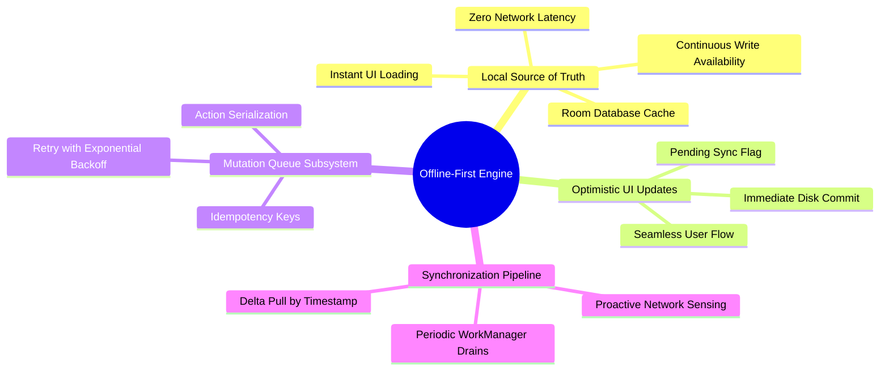

# 01.2 Offline-First Design Principles

#architecture #offline-first #room #sqlite #data-sync #reliability

In standard web applications, the network is assumed to be constantly available, and UI components block user interactions while waiting for HTTP responses. The El-Imtiyaz architecture flips this model completely: **The local database is the single source of truth**, and network connectivity is treated as an opportunistic enhancement.

---

## 1. Offline-First Principles Mind Map

---

## 2. The Four Pillars of the Offline-First Architecture

### 2.1 Pillar 1: Local Read Supremacy
All UI screens query and observe Room DAOs using `Flow<T>`. When a user navigates to the Student Directory, Parent CRM, or Ledger Summary:
- The screen renders data immediately from disk in 0 to 10 milliseconds.
- There are no full-screen loading spinners blocking navigation.
- If the device is in airplane mode or experiencing network congestion, the user experiences zero interruption.

### 2.2 Pillar 2: Optimistic Local Writes
When an administrator records a cash tuition payment or registers a new student:
1. A unique entity ID (e.g., UUID v4) is generated locally on the device.
2. The entity is immediately written to Room SQLite.
3. The UI emits a success state and updates tables in real time.
4. An entry is appended to the local `sync_queue` table with `status = 'pending'`.

### 2.3 Pillar 3: Decoupled Synchronization
Network communication happens entirely in background coroutines managed by Android `WorkManager`:
- The sync worker inspects `sync_queue`.
- For each pending mutation, it sends the payload to Supabase with an `idempotency_key`.
- If successful, the queue entry is marked `status = 'synced'` or removed.
- If the server returns a temporary network error or 5xx code, the transaction remains queued, and exponential backoff is applied.

### 2.4 Pillar 4: Reactive Delta Pulls
- Background sync periodically queries Supabase for updates since the last synchronization timestamp (`p_since = last_sync_time`).
- Fresh and updated rows are upserted directly into Room.
- Because Room DAOs expose Kotlin `Flow`, any newly upserted rows automatically trigger UI recomposition without requiring manual pull-to-refresh.

---

## 3. Local vs Remote Data Flow Comparison

| Feature | Standard Cloud-First App | El-Imtiyaz Offline-First System |
| :--- | :--- | :--- |
| **Initial Screen Render** | Waits for HTTP request (200-2000ms) | Reads local SQLite database (5-15ms) |
| **Network Outage Behavior** | App crashes or shows error dialogs | 100% full read/write functionality |
| **Data Synchronization** | Synchronous REST blocking | Asynchronous idempotent background queue |
| **Battery & Data Usage** | Frequent redundant payload downloads | Delta synchronization with timestamp filters |

---

## 4. Architectural Tips and Student Pitfalls

> [!TIP]
> **Tip: Always generate primary keys client-side.**
> Never rely on auto-incrementing database sequences from the server (`SERIAL` or `BIGSERIAL`) in an offline-first app. Use standard UUIDs (`UUID.randomUUID().toString()`) so that entities created offline have permanent, stable IDs before ever reaching the backend.

> [!CAUTION]
> **Student Trap: Forgetting Idempotency.**
> If a network timeout occurs while sending a payment mutation, the device cannot know whether the server processed the request or failed. Without an `idempotency_key` unique to that payment attempt, retrying might record the tuition payment twice! Always attach unique mutation IDs.

---

## 5. Key Cross-References

- System Context: [[01.1 System Architecture Overview]]
- Queue Implementation: [[04.2 Push Mutation Queue and Idempotency Keys]]
- Conflict Handling: [[04.3 Conflict Resolution and Last-Write-Wins]]
- Implementation Exercise: [[07.4 Exercise 3 - Building an Offline-First Sync Worker]]
