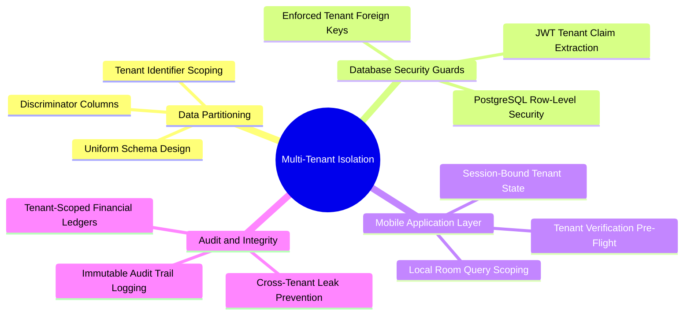

# 01.3 Multi-Tenant Isolation Strategy

#security #multi-tenancy #architecture #database #rls

El-Imtiyaz is architected as a **multi-tenant SaaS platform** capable of serving multiple independent private schools, educational complexes, and regional learning centers from a unified infrastructure while guaranteeing complete cryptographic, logical, and operational data isolation.

---

## 1. Multi-Tenant Isolation Mind Map



---

## 2. Multi-Tenancy Architecture Patterns

### 2.1 The Shared Database, Shared Schema Pattern
Rather than provisioning isolated database instances or Postgres schemas per school (which drastically increases connection pooling overhead and maintenance complexity), El-Imtiyaz uses a **Shared Database with Discriminator Column (`tenant_id`)** pattern.

Every single table across both local SQLite and remote PostgreSQL contains a `tenant_id` column:
- `parents.tenant_id`
- `students.tenant_id`
- `payments.tenant_id`
- `ledger_entries.tenant_id`
- `classes.tenant_id`
- `personnel.tenant_id`

```sql
-- Example Schema DDL enforcing tenant isolation
CREATE TABLE students (
    id UUID PRIMARY KEY DEFAULT gen_random_uuid(),
    tenant_id VARCHAR(64) NOT NULL,
    parent_id UUID NOT NULL REFERENCES parents(id) ON DELETE RESTRICT,
    student_code VARCHAR(32) NOT NULL,
    first_name VARCHAR(128) NOT NULL,
    last_name VARCHAR(128) NOT NULL,
    is_active BOOLEAN NOT NULL DEFAULT TRUE,
    created_at TIMESTAMPTZ NOT NULL DEFAULT NOW(),
    updated_at TIMESTAMPTZ NOT NULL DEFAULT NOW()
);

CREATE INDEX idx_students_tenant ON students(tenant_id);
```

---

## 3. Remote Row-Level Security (RLS) Enforcement

Security in Supabase is enforced at the database engine level via PostgreSQL Row-Level Security (RLS). Even if a malicious or compromised client attempts to query rows belonging to another school, PostgreSQL filters the results before returning them over HTTP.

### 3.1 PostgreSQL Policy Definition
```sql
ALTER TABLE students ENABLE ROW LEVEL SECURITY;

CREATE POLICY tenant_isolation_policy ON students
    AS RESTRICTIVE
    FOR ALL
    TO authenticated
    USING (
        tenant_id = (auth.jwt() -> 'app_metadata' ->> 'tenant_id')
    )
    WITH CHECK (
        tenant_id = (auth.jwt() -> 'app_metadata' ->> 'tenant_id')
    );
```

---

## 4. Mobile Client-Side Scoping

On the Android client, `SessionManager` extracts and caches the `tenant_id` upon successful authentication:
1. All Room queries filter by the active session's tenant ID where required.
2. When creating new entities (Parents, Payments, Notes), the entity constructor automatically stamps `tenantId = sessionManager.currentTenantId()`.
3. If no tenant ID is available in the current session token, the application falls back to the configured institutional default (`"ten-elimtiyaz-001"`).

---

## 5. Tips and Common Security Pitfalls

> [!WARNING]
> **Trap: Unindexed Tenant Queries.**
> In a multi-tenant database with millions of rows, querying `WHERE tenant_id = 'xxx'` without a composite index on `(tenant_id, id)` or `(tenant_id, created_at)` will force full table scans, degrading performance for all tenants.

> [!TIP]
> **Tip: Never trust client-provided tenant headers.**
> In cloud API endpoints, always extract the tenant identity directly from the cryptographically signed JWT claim (`auth.jwt()`), never from user-editable request parameters or unauthenticated request headers.

---

## 6. Key Cross-References

- System Architecture: [[01.1 System Architecture Overview]]
- Security Policies: [[02.3 Supabase Authentication and RLS Policies]]
- User Permissions: [[02.1 Role-Based Access Control Engine]]
