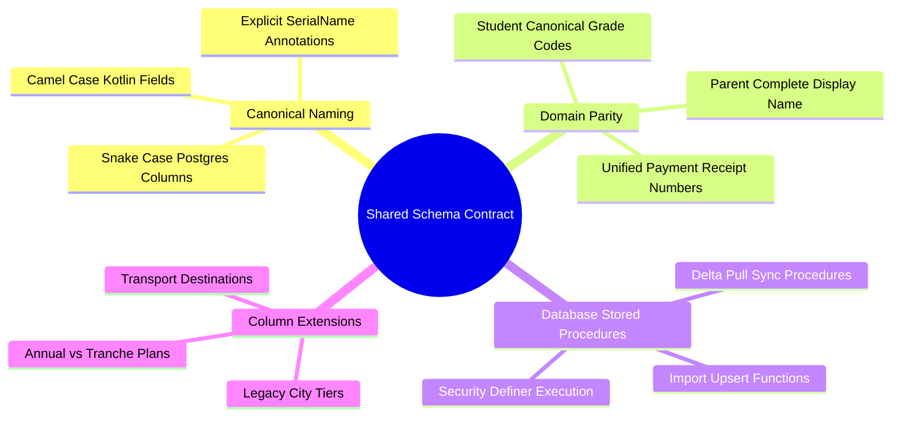

# 01.4 Mobile vs Desktop Shared Schema Contract

#schema #database #supabase #desktop #mobile #interoperability

The El-Imtiyaz platform consists of a **Desktop Administrative Suite** (used by school accountants and registrar officers for bulk Excel imports and complex reporting) and an **Android Mobile Application** (used by school directors, teachers, transport drivers, and staff). 

Both clients interface with the identical Supabase PostgreSQL database. This document formalizes the canonical schema contracts, column mappings, and stored procedure interfaces established in **Migrations 0027 and 0028**.

---

## 1. Schema Unification Mind Map



---

## 2. Shared Data Transfer Objects (DTOs)

To prevent silent JSON deserialization failures where Kotlin data classes populate default values instead of server data, every single DTO in the mobile application carries explicit `@SerialName` annotations matching the PostgreSQL column name.

### 2.1 Canonical Parent DTO
```kotlin
@Serializable
data class ParentDto(
    @SerialName("id") val id: String,
    @SerialName("tenant_id") val tenantId: String? = null,
    @SerialName("parent_code") val parentCode: String? = null,
    @SerialName("first_name") val firstName: String,
    @SerialName("last_name") val lastName: String,
    @SerialName("display_name") val displayName: String? = null,
    @SerialName("primary_phone") val primaryPhone: String,
    @SerialName("secondary_phone") val secondaryPhone: String? = null,
    @SerialName("email") val email: String? = null,
    @SerialName("occupation") val occupation: String? = null,
    @SerialName("address") val address: String? = null,
    @SerialName("city") val city: String? = null,
    @SerialName("transport_destination") val transportDestination: String? = null,
    @SerialName("city_tier") val cityTier: String? = null,
    @SerialName("is_active") val isActive: Boolean = true,
    @SerialName("created_at") val createdAt: String? = null,
    @SerialName("updated_at") val updatedAt: String? = null,
)
```

### 2.2 Canonical Student DTO
```kotlin
@Serializable
data class StudentDto(
    @SerialName("id") val id: String,
    @SerialName("tenant_id") val tenantId: String? = null,
    @SerialName("parent_id") val parentId: String,
    @SerialName("student_code") val studentCode: String? = null,
    @SerialName("first_name") val firstName: String,
    @SerialName("last_name") val lastName: String,
    @SerialName("display_name") val displayName: String? = null,
    @SerialName("date_of_birth") val dateOfBirth: String? = null,
    @SerialName("gender") val gender: String? = null,
    @SerialName("grade_level_code") val gradeLevelCode: String? = null,
    @SerialName("class_id") val classId: String? = null,
    @SerialName("enrollment_status") val enrollmentStatus: String? = "active",
    @SerialName("transport_tier") val transportTier: String? = null,
    @SerialName("payment_plan") val paymentPlan: String? = "tranches",
    @SerialName("is_active") val isActive: Boolean = true,
    @SerialName("created_at") val createdAt: String? = null,
    @SerialName("updated_at") val updatedAt: String? = null,
)
```

---

## 3. Remote Procedure Call (RPC) Contracts

When desktop users import Excel spreadsheets, PostgreSQL procedures execute upserts. The mobile app sync engine invokes corresponding pull procedures to retrieve updated rows.

### 3.1 Pull Procedure Signatures
```sql
-- Pull all parent modifications since timestamp
CREATE OR REPLACE FUNCTION pull_parents_for_sync(
    p_tenant_id VARCHAR,
    p_since TIMESTAMPTZ DEFAULT NULL,
    p_limit INT DEFAULT 1000
) RETURNS SETOF parents
LANGUAGE sql SECURITY DEFINER STABLE AS $$
    SELECT * FROM parents
    WHERE tenant_id = p_tenant_id
      AND (p_since IS NULL OR updated_at > p_since)
    ORDER BY updated_at ASC
    LIMIT p_limit;
$$;
```

---

## 4. Key Cross-References

- Architecture Foundations: [[01.1 System Architecture Overview]]
- Pull Sync Mechanics: [[04.1 Pull Sync and PostgREST RPC Synchronization]]
- Academic Domain: [[05.1 Student and Parent Family CRM]]
