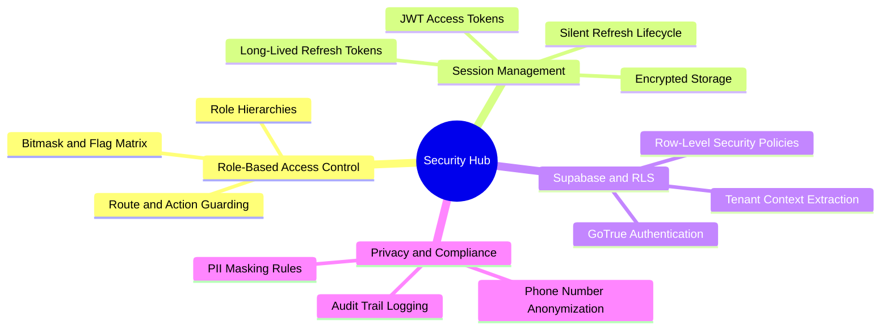

# 02. Master Security and Auth Map of Content (MOC)

#security #auth #rbac #privacy #chapter2 #moc

This module covers authentication, authorization, session recovery, role hierarchies, and privacy protection protocols in El-Imtiyaz.

---

## 1. Chapter Security Mind Map

---

## 2. Topic Exploration Pathways

- **RBAC Matrix**: Study [[02.1 Role-Based Access Control Engine]] to understand how 7 user roles map to 24 granular functional permissions.
- **Session Lifecycle**: Read [[02.2 Session State and Token Refresh Lifecycle]] to learn how offline JWT validation and automatic background token rotation work.
- **Supabase Authentication**: Review [[02.3 Supabase Authentication and RLS Policies]] for implementation details on GoTrue integration, token claims, and database policies.
- **Privacy Standards**: Consult [[02.4 PII Masking and Privacy Enforcement]] for Algerian privacy compliance, phone number masking (`0555 *** **89`), and address redacting.

---

## 3. Core Security Invariants

1. **Deny by Default**: Any route or action without explicit permission grant is forbidden.
2. **Offline Authorization**: Role permissions are computed deterministically on the client without requiring a round-trip network call.
3. **No Plaintext PII**: Sensitive financial and contact records must be masked on non-privileged overview screens.
