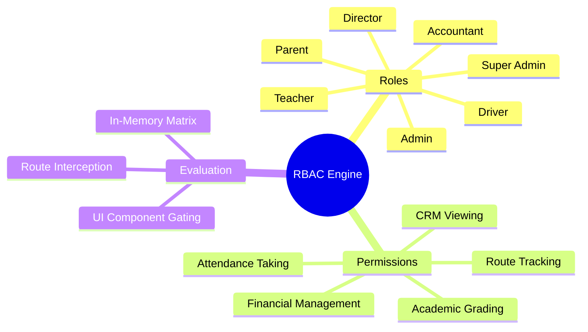

# 02.1 Role-Based Access Control Engine

#security #rbac #permissions #authorization #roles

The El-Imtiyaz platform implements a granular **Role-Based Access Control (RBAC)** engine that regulates what screens a user can navigate to, what mutations they can submit, and what data fields they can view.

---

## 1. RBAC Engine Mind Map



---

## 2. The 7 Canonical Roles

| Role Code | Title | Responsibilities & Scope |
| :--- | :--- | :--- |
| `super_admin` | Global Super Administrator | Unrestricted access across all modules, configuration, and tenant settings. |
| `admin` | School Administrator | Full operational management: admissions, personnel, classes, fees, workflows. |
| `accountant` | Chief Accountant / Bursar | Counter payments, expense approvals, ledger reviews, debt tracking, audits. |
| `director` | Educational Director | Academic oversight, pedagogical schedules, teacher assignments, report cards. |
| `teacher` | Instructor / Homeroom Teacher | Daily attendance, homework submission, student assessments, exam grading. |
| `driver` | Transport Driver | Bus routing, student pickup verification, geolocation tracking. |
| `parent` | Student Guardian | Read-only access to their children's grades, attendance, and tuition balance. |

---

## 3. The Permission Mapping Matrix

The engine maps 24 granular permissions to the respective roles:

```kotlin
enum class Permission {
    VIEW_FINANCES,
    COLLECT_PAYMENTS,
    APPROVE_EXPENSES,
    VIEW_LEDGER,
    MANAGE_STUDENTS,
    MANAGE_PARENTS,
    MANAGE_CLASSES,
    TAKE_ATTENDANCE,
    SUBMIT_GRADES,
    MANAGE_HOMEWORK,
    TRACK_BUS_ROUTES,
    VIEW_REPORTS,
    MANAGE_SETTINGS,
    VIEW_PII,
    MANAGE_PERSONNEL,
}

fun Role.hasPermission(permission: Permission): Boolean = when (this) {
    Role.SUPER_ADMIN -> true
    Role.ADMIN -> permission != Permission.MANAGE_SETTINGS || this == Role.SUPER_ADMIN
    Role.ACCOUNTANT -> permission in setOf(
        Permission.VIEW_FINANCES,
        Permission.COLLECT_PAYMENTS,
        Permission.APPROVE_EXPENSES,
        Permission.VIEW_LEDGER,
        Permission.VIEW_REPORTS,
        Permission.MANAGE_PARENTS,
    )
    Role.DIRECTOR -> permission in setOf(
        Permission.MANAGE_STUDENTS,
        Permission.MANAGE_CLASSES,
        Permission.TAKE_ATTENDANCE,
        Permission.SUBMIT_GRADES,
        Permission.VIEW_REPORTS,
        Permission.VIEW_FINANCES,
    )
    Role.TEACHER -> permission in setOf(
        Permission.TAKE_ATTENDANCE,
        Permission.SUBMIT_GRADES,
        Permission.MANAGE_HOMEWORK,
    )
    Role.DRIVER -> permission in setOf(
        Permission.TRACK_BUS_ROUTES,
    )
    Role.PARENT -> false // Parents have customized read-only portals
}
```

---

## 4. UI Route Interception

When navigating using Navigation Compose, each route is guarded by an `rbacGate`:

```kotlin
fun NavGraphBuilder.guardedComposable(
    route: String,
    requiredPermission: Permission,
    content: @Composable (NavBackStackEntry) -> Unit
) {
    composable(route) { backStackEntry ->
        val session = LocalSession.current
        if (session != null && session.role.hasPermission(requiredPermission)) {
            content(backStackEntry)
        } else {
            PermissionDeniedScreen()
        }
    }
}
```

---

## 5. Tips and Common Security Pitfalls

> [!CAUTION]
> **Trap: UI-Only Gating.**
> Hiding a button on the UI is NOT security. All backend RPCs and data mutation repositories must independently verify the caller's role before applying state modifications to the database.

---

## 6. Key Cross-References

- Session Binding: [[02.2 Session State and Token Refresh Lifecycle]]
- Navigation System: [[06.2 Navigation Compose and Type-Safe Routing]]
- Privacy Policies: [[02.4 PII Masking and Privacy Enforcement]]
