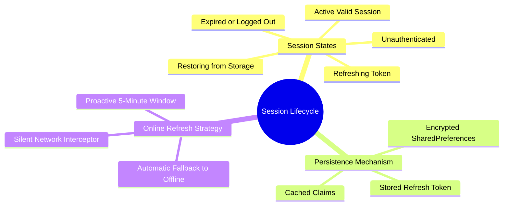

# 02.2 Session State and Token Refresh Lifecycle

#security #auth #session #jwt #tokens #lifecycle

Session management in an offline-first system must balance two conflicting requirements:
1. **Security**: Short-lived JWT access tokens (typically 1 hour) prevent unauthorized access if a token is intercepted.
2. **Offline Usability**: Staff members working without internet connectivity must not be logged out abruptly while teaching a class or driving a transport route.

---

## 1. Session State Machine Mind Map



---

## 2. Session Data Model

```kotlin
data class Session(
    val userId: String,
    val email: String,
    val fullName: String,
    val role: Role,
    val tenantId: String,
    val accessToken: String,
    val refreshToken: String,
    val expiresAtEpochMs: Long,
) {
    val isExpired: Boolean
        get() = System.currentTimeMillis() >= expiresAtEpochMs

    val needsRefresh: Boolean
        get() = (expiresAtEpochMs - System.currentTimeMillis()) < 5 * 60 * 1000 // 5 minutes buffer
}
```

---

## 3. The Session Recovery Algorithm

When the application cold-starts (in `MainActivity` / `ElImtiyazApplication`):

```
1. App launches -> AppNavViewModel.restoreSession()
2. Read encrypted token storage from device disk.
3. If no tokens exist -> Emit null (Navigate to LoginScreen).
4. If tokens exist:
    a. Check if accessToken is still valid:
       - If valid -> Emit Session(role, tenantId) immediately -> Show MainScreen.
    b. If accessToken is expired or close to expiry:
       - Check network availability:
           * If ONLINE -> Request new access token from Supabase using refreshToken.
             Update storage -> Emit refreshed Session.
           * If OFFLINE -> Trust cached claims locally until network reconnects.
```

---

## 4. Tips and Student Reminders

> [!TIP]
> **Tip: Never block UI startup on network token validation.**
> Always restore the session optimistically from secure local storage and display the dashboard instantly. Trigger the token refresh asynchronously on a background coroutine (`Dispatchers.IO`).

---

## 5. Key Cross-References

- RBAC Rules: [[02.1 Role-Based Access Control Engine]]
- Supabase Integration: [[02.3 Supabase Authentication and RLS Policies]]
- Navigation Lifecycle: [[06.2 Navigation Compose and Type-Safe Routing]]
