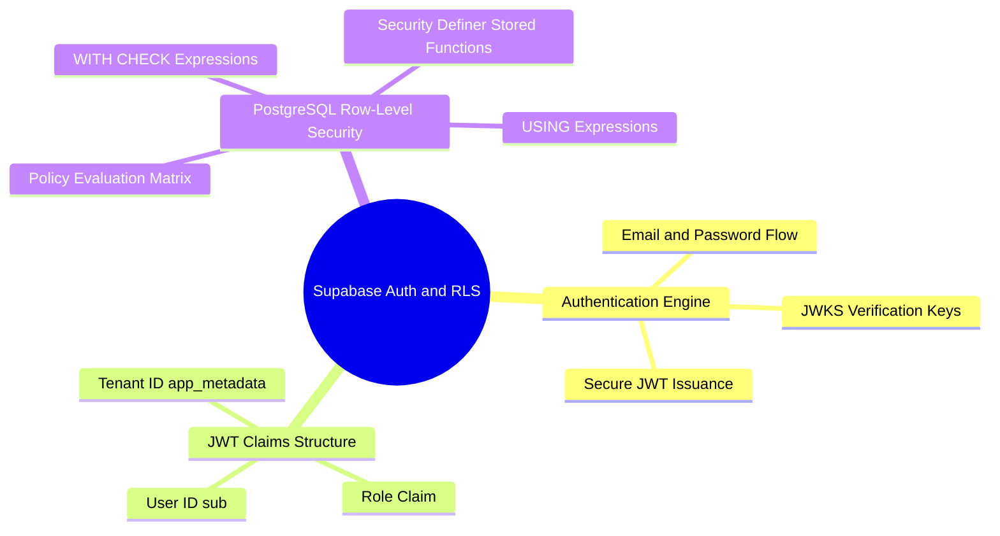

# 02.3 Supabase Authentication and RLS Policies

#security #supabase #database #rls #postgres #jwt

Supabase provides backend authentication via the **GoTrue** microservice and data access control via PostgreSQL's native **Row-Level Security (RLS)** engine.

---

## 1. Supabase Security Architecture Mind Map



---

## 2. JWT Token Payload Structure

When a user logs in, Supabase issues a cryptographically signed JSON Web Token containing identity claims:

```json
{
  "iss": "https://hkvkefubghbbotgnteir.supabase.co/auth/v1",
  "sub": "a0eebc99-9c0b-4ef8-bb6d-6bb9bd380a11",
  "aud": "authenticated",
  "exp": 1770000000,
  "email": "merselfaresw@gmail.com",
  "app_metadata": {
    "provider": "email",
    "role": "super_admin",
    "tenant_id": "ten-elimtiyaz-001"
  },
  "user_metadata": {
    "full_name": "Fares Mersel",
    "preferred_language": "fr"
  }
}
```

---

## 3. Database RLS Policies

### 3.1 Strict Financial Ledger Isolation Policy
Only users with role `super_admin`, `admin`, or `accountant` can insert payment records into their school's tenant partition.

```sql
ALTER TABLE payments ENABLE ROW LEVEL SECURITY;

CREATE POLICY accountant_payment_policy ON payments
    FOR ALL
    TO authenticated
    USING (
        tenant_id = (auth.jwt() -> 'app_metadata' ->> 'tenant_id')
        AND (
            (auth.jwt() -> 'app_metadata' ->> 'role') IN ('super_admin', 'admin', 'accountant')
        )
    )
    WITH CHECK (
        tenant_id = (auth.jwt() -> 'app_metadata' ->> 'tenant_id')
        AND (
            (auth.jwt() -> 'app_metadata' ->> 'role') IN ('super_admin', 'admin', 'accountant')
        )
    );
```

---

## 4. Key Cross-References

- RBAC Rules: [[02.1 Role-Based Access Control Engine]]
- Multi-Tenancy: [[01.3 Multi-Tenant Isolation Strategy]]
- PostgREST Pull: [[04.1 Pull Sync and PostgREST RPC Synchronization]]
