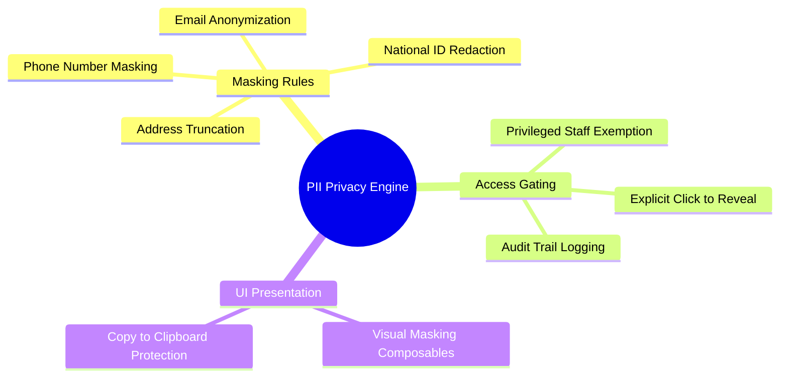

# 02.4 PII Masking and Privacy Enforcement

#security #privacy #pii #gdpr #data-protection

Personally Identifiable Information (PII) — including Algerian national ID numbers, parent phone numbers, home addresses, and confidential medical notes — must be protected against shoulder surfing and unauthorized internal exposure.

---

## 1. PII Protection Mind Map



---

## 2. Masking Algorithms and Rules

### 2.1 Algerian Mobile Phone Numbers
Algerian mobile numbers (format: `0555 12 34 56` or `+213 555 123 456`) are masked to reveal only the operator prefix and the trailing two digits:

- **Raw**: `0555 12 34 56`
- **Masked**: `0555 ••• •56`

```kotlin
object PiiMask {
    fun maskPhone(phone: String?): String {
        if (phone.isNullOrBlank()) return "—"
        val clean = phone.replace(Regex("[^0-9+]"), "")
        if (clean.length < 6) return "••••••"
        val prefix = clean.take(4)
        val suffix = clean.takeLast(2)
        return "$prefix ••• •$suffix"
    }

    fun maskEmail(email: String?): String {
        if (email.isNullOrBlank()) return "—"
        val parts = email.split("@")
        if (parts.size != 2) return "••••@••••"
        val name = parts[0]
        val domain = parts[1]
        val maskedName = if (name.length <= 2) name.first() + "***" else name.first() + "***" + name.last()
        return "$maskedName@$domain"
    }
}
```

---

## 3. Key Cross-References

- RBAC Rules: [[02.1 Role-Based Access Control Engine]]
- Family CRM: [[05.1 Student and Parent Family CRM]]
