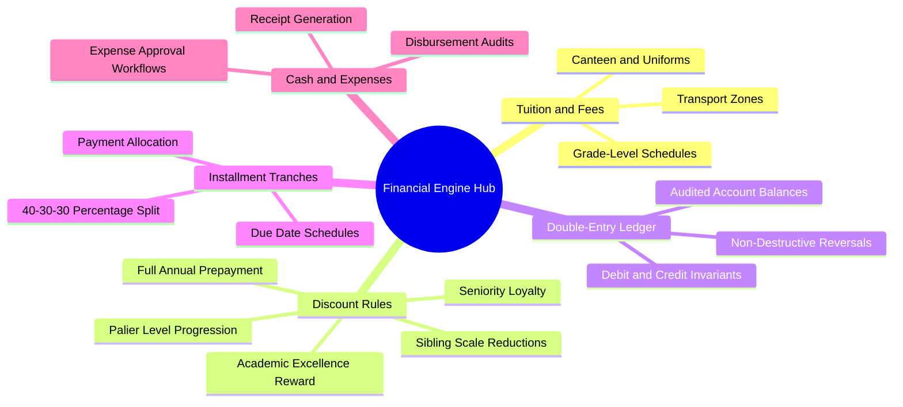

# 03. Master Financial Engine Map of Content (MOC)

#finance #accounting #ledger #pricing #chapter3 #moc

This module covers the core financial computation engine of El-Imtiyaz: Algerian Dinars (DZD) pricing tariffs, the 5 canonical school discounts, double-entry ledger bookkeeping invariants, installment tranche scheduling, and counter cash handling.

---

## 1. Chapter Financial Mind Map

---

## 2. Topic Exploration Pathways

- **Tuition & Tariffs**: Study [[03.1 Algerian School Pricing and Fee Schedules]] for the complete fee breakdown across 14 grade levels and 4 transport zones.
- **Discount Engine**: Review [[03.2 Five Canonical Discount Calculations]] for the mathematical formulas, stacking rules, and edge cases.
- **Double-Entry Ledger**: Read [[03.3 Double-Entry Ledger Engine and Invariants]] to master the debits/credits invariant: $\sum \text{Debits} \equiv \sum \text{Credits}$.
- **Tranches & Installments**: Explore [[03.4 Installment Tranche Scheduling and Reconciliation]] for the 40%/30%/30% payment schedule and balance resolution.
- **Cash Desk & Expenses**: Consult [[03.5 Cash Counter and Expense Workflows]] for receipt issuance, cash register balances, and multi-signature expense disbursements.

---

## 3. Financial Invariants and Golden Rules

1. **Integer Arithmetic Only (Centimes)**: Never use floating-point types (`Float` or `Double`) for money. All calculations must use 64-bit Long integers representing centimes ($1 \text{ DZD} = 100 \text{ centimes}$).
2. **Immutable Ledgers**: Never `UPDATE` or `DELETE` an existing financial transaction. Errors must be corrected exclusively via balanced `REVERSAL` ledger entries.
3. **Deterministic Rounding**: All percentage discounts and tranche allocations round down to the nearest integer centime to prevent currency drift.
