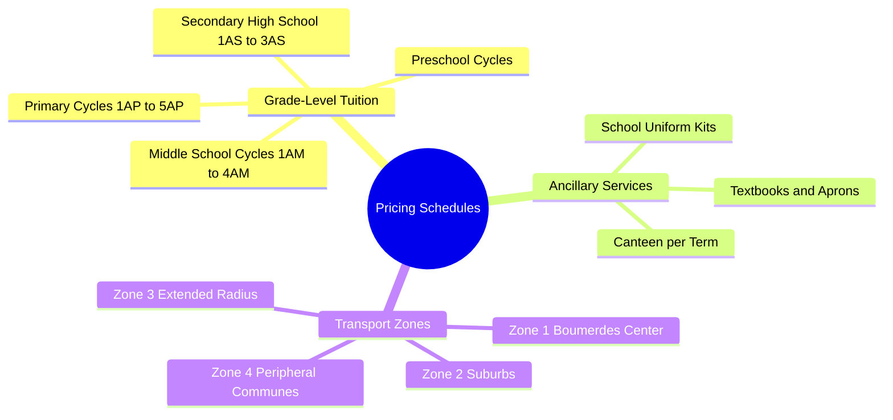

# 03.1 Algerian School Pricing and Fee Schedules

#finance #pricing #tariffs #algeria #dzd #centimes

El-Imtiyaz operates in Boumerdès, Algeria. All currency figures in this system are calculated internally in **centimes** ($1 \text{ DZD} = 100 \text{ centimes}$) to eliminate IEEE 754 floating-point inaccuracies.

---

## 1. Pricing Structure Mind Map

---

## 2. Canonical 2026-2027 Tuition Schedules

| Grade Level Code | Level Description | Annual Tuition (DZD) | Annual Tuition (Centimes) | Tranche 1 (40%) | Tranche 2 (30%) | Tranche 3 (30%) |
| :--- | :--- | :--- | :--- | :--- | :--- | :--- |
| `prescolaire_1` | Préscolaire Petite Section | 130,000 DA | 13,000,000 | 5,200,000 | 3,900,000 | 3,900,000 |
| `prescolaire_2` | Préscolaire Grande Section | 180,000 DA | 18,000,000 | 7,200,000 | 5,400,000 | 5,400,000 |
| `1ap` | 1ère Année Primaire | 245,000 DA | 24,500,000 | 9,800,000 | 7,350,000 | 7,350,000 |
| `2ap` | 2ème Année Primaire | 265,000 DA | 26,500,000 | 10,600,000 | 7,950,000 | 7,950,000 |
| `3ap` | 3ème Année Primaire | 280,000 DA | 28,000,000 | 11,200,000 | 8,400,000 | 8,400,000 |
| `4ap` | 4ème Année Primaire | 295,000 DA | 29,500,000 | 11,800,000 | 8,850,000 | 8,850,000 |
| `5ap` | 5ème Année Primaire | 310,000 DA | 31,000,000 | 12,400,000 | 9,300,000 | 9,300,000 |
| `1am` | 1ère Année CEM | 330,000 DA | 33,000,000 | 13,200,000 | 9,900,000 | 9,900,000 |
| `2am` | 2ème Année CEM | 345,000 DA | 34,500,000 | 13,800,000 | 10,350,000 | 10,350,000 |
| `3am` | 3ème Année CEM | 360,000 DA | 36,000,000 | 14,400,000 | 10,800,000 | 10,800,000 |
| `4am` | 4ème Année CEM (BEM) | 380,000 DA | 38,000,000 | 15,200,000 | 11,400,000 | 11,400,000 |
| `1as` | 1ère Année Secondaire | 400,000 DA | 40,000,000 | 16,000,000 | 12,000,000 | 12,000,000 |
| `2as` | 2ème Année Secondaire | 420,000 DA | 42,000,000 | 16,800,000 | 12,600,000 | 12,600,000 |
| `3as` | 3ème Année Secondaire (BAC) | 450,000 DA | 45,000,000 | 18,000,000 | 13,500,000 | 13,500,000 |

---

## 3. Ancillary Services and Extras

- **School Canteen (Cantine)**: `12,000 DZD` / term (`1,200,000 centimes`) $\times 3 \text{ terms} = 36,000 \text{ DZD}$ annual.
- **Mandatory Uniform Kit**: `8,500 DZD` (`850,000 centimes`).
- **Second Apron (Tablier supplémentaire)**: `2,000 DZD` (`200,000 centimes`).
- **Official Textbooks (Livres scolaires)**: `6,500 DZD` (`650,000 centimes`).
- **Late Payment Penalty**: `200 centimes` (2 DZD) per overdue calendar day.

---

## 4. Transport Zone Tariffs

| Zone Code | Geographic Coverage (Boumerdès) | Annual Round-Trip Fee (DZD) | Annual Fee (Centimes) |
| :--- | :--- | :--- | :--- |
| `zone_1` | Centre-ville, 11 Décembre, Plateau | 35,000 DA | 3,500,000 |
| `zone_2` | Corson, Figuier, Rocade Sud | 45,000 DA | 4,500,000 |
| `zone_3` | Tidjelabine, Sahel, Thénia | 58,000 DA | 5,800,000 |
| `zone_4` | Zemmouri, Si Mustapha, Cap Djinet | 72,000 DA | 7,200,000 |

---

## 5. Key Cross-References

- Discount Deductions: [[03.2 Five Canonical Discount Calculations]]
- Tranche Management: [[03.4 Installment Tranche Scheduling and Reconciliation]]
- Calculation Practice: [[07.2 Exercise 1 - Calculating Sibling and Palier Discounts]]
