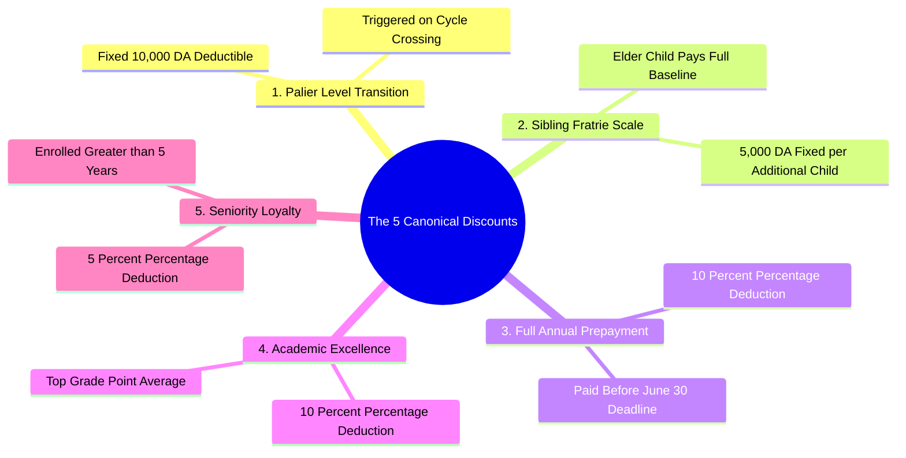

# 03.2 Five Canonical Discount Calculations

#finance #discounts #pricing #algeria #business-logic

El-Imtiyaz codifies **five canonical tuition discount rules**. These discounts reward family enrollment, level transitions, early annual settlement, academic excellence, and staff/institutional seniority.

---

## 1. Discounts Mind Map

---

## 2. Mathematical Definitions of the 5 Discounts

### 2.1 Discount 1: Passage de Palier (`passage_palier`)
- **Category**: Fixed Amount Deduction.
- **Value**: $-10,000\text{ DZD}$ ($-1,000,000\text{ centimes}$).
- **Condition**: Awarded when a student crosses from Primary to Middle School (5AP $\rightarrow$ 1AM) or Middle to High School (4AM $\rightarrow$ 1AS).

### 2.2 Discount 2: Sibling Scale (`sibling_fixed`)
- **Category**: Fixed Amount per Additional Child.
- **Value**: $-5,000\text{ DZD}$ ($-500,000\text{ centimes}$) per supplementary enrolled child.
- **Condition**: In a family with $N$ active enrolled children:
  $$\text{Total Sibling Discount} = (N - 1) \times 5,000\text{ DZD}$$
  - 1 Child: $0\text{ DZD}$
  - 2 Children: $-5,000\text{ DZD}$
  - 3 Children: $-10,000\text{ DZD}$
  - 4 Children: $-15,000\text{ DZD}$

### 2.3 Discount 3: Full Annual Settlement (`full_annual`)
- **Category**: Percentage Deduction.
- **Value**: $-10\%$ off net tuition.
- **Condition**: Entire annual tuition paid in a single lump sum prior to **June 30**.

### 2.4 Discount 4: Highest Academic Average (`highest_average`)
- **Category**: Percentage Deduction.
- **Value**: $-10\%$ off net tuition.
- **Condition**: Ranked #1 student across the cycle/palier during the prior academic term.

### 2.5 Discount 5: Seniority Loyalty (`seniority_5y`)
- **Category**: Percentage Deduction.
- **Value**: $-5\%$ off net tuition.
- **Condition**: Continuous family enrollment exceeding 5 consecutive academic years.

---

## 3. Order of Operations and Stacking Rules

When a student qualifies for multiple discounts, they are evaluated in the following deterministic sequence:

$$\text{Base Tuition} \xrightarrow{\text{Subtract Fixed Discounts}} \text{Adjusted Base} \xrightarrow{\text{Apply Percentage Discounts}} \text{Final Net Tuition}$$

1. **Step 1: Calculate Gross Tuition ($T_{\text{gross}}$)** from grade level schedule.
2. **Step 2: Subtract Fixed Deductions ($D_{\text{fixed}}$)**:
   $$D_{\text{fixed}} = D_{\text{palier}} + D_{\text{sibling}}$$
   $$T_{\text{subtotal}} = \max(0, T_{\text{gross}} - D_{\text{fixed}})$$
3. **Step 3: Calculate Cumulative Percentage Rate ($P_{\text{rate}}$)**:
   $$P_{\text{rate}} = \min(30\%, P_{\text{annual}} + P_{\text{excellence}} + P_{\text{seniority}})$$
4. **Step 4: Compute Final Net Tuition ($T_{\text{net}}$)**:
   $$D_{\text{percent}} = \lfloor T_{\text{subtotal}} \times (P_{\text{rate}} / 100) \rfloor$$
   $$T_{\text{net}} = T_{\text{subtotal}} - D_{\text{percent}}$$

---

## 4. Key Cross-References

- Tariff Baseline: [[03.1 Algerian School Pricing and Fee Schedules]]
- Ledger Records: [[03.3 Double-Entry Ledger Engine and Invariants]]
- Comprehensive Worked Exercise: [[07.2 Exercise 1 - Calculating Sibling and Palier Discounts]]
