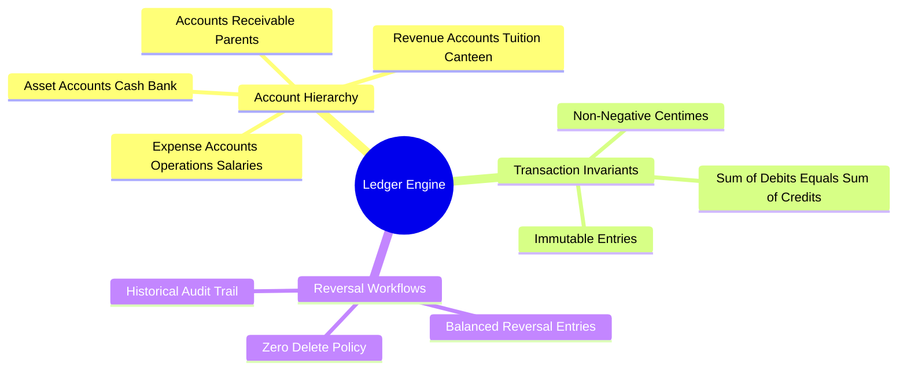

# 03.3 Double-Entry Ledger Engine and Invariants

#finance #accounting #ledger #double-entry #invariants

The El-Imtiyaz platform incorporates a strict, immutable **Double-Entry General Ledger Engine**. This accounting structure prevents silent money discrepancies, guarantees full auditability, and conforms to standard institutional bookkeeping practices.

---

## 1. Ledger Architecture Mind Map



---

## 2. The Fundamental Ledger Invariant

Every financial event in the school produces a balanced transaction composed of at least one debit entry and at least one credit entry:

$$\sum \text{Debits} \equiv \sum \text{Credits}$$

### 2.1 The Chart of Accounts

| Account Code | Account Name | Type | Normal Balance |
| :--- | :--- | :--- | :--- |
| `1010` | Cash on Hand (Caisse) | Asset | Debit |
| `1020` | Bank Account (Compte Bancaire BNA/CPA) | Asset | Debit |
| `1200` | Accounts Receivable (Créances Parents) | Asset | Debit |
| `4010` | Tuition Revenue (Revenus Scolarité) | Revenue | Credit |
| `4020` | Transport Revenue (Revenus Transport) | Revenue | Credit |
| `4030` | Canteen Revenue (Revenus Cantine) | Revenue | Credit |
| `5010` | Teacher Salaries Expense (Salaires Enseignants) | Expense | Debit |
| `5020` | School Supplies Expense (Fournitures Pédagogiques) | Expense | Debit |

---

## 3. Transaction Examples

### 3.1 Scenario A: Initial Student Tuition Invoicing
When Student Sara (3AP) is enrolled for the 2026-2027 year, her tuition charge of $280,000\text{ DZD}$ ($28,000,000\text{ centimes}$) is billed:

- **Debit**: `1200 - Accounts Receivable` ($+28,000,000\text{ centimes}$)
- **Credit**: `4010 - Tuition Revenue` ($+28,000,000\text{ centimes}$)
- *Balance Check*: $28,000,000 - 28,000,000 = 0$. Invariant maintained.

### 3.2 Scenario B: First Tranche Cash Payment
Parent pays Tranche 1 ($112,000\text{ DZD}$ = $11,200,000\text{ centimes}$) in cash at the counter:

- **Debit**: `1010 - Cash on Hand` ($+11,200,000\text{ centimes}$)
- **Credit**: `1200 - Accounts Receivable` ($-11,200,000\text{ centimes}$)
- *Remaining Family Balance*: $28,000,000 - 11,200,000 = 16,800,000\text{ centimes}$ ($168,000\text{ DZD}$).

---

## 4. Non-Destructive Reversals

If a payment receipt is entered with an incorrect amount or bouncing check, the entry is **never deleted**. The system records a compensating reversal entry referencing the original entry ID:

```kotlin
fun reverseEntry(original: LedgerEntryEntity, reason: String, actorId: String): LedgerEntryEntity {
    return LedgerEntryEntity(
        id = UUID.randomUUID().toString(),
        tenantId = original.tenantId,
        accountId = original.accountId,
        parentId = original.parentId,
        studentId = original.studentId,
        type = if (original.type == "debit") "credit" else "debit",
        amount = original.amount,
        reversesId = original.id,
        notes = "Reversal: $reason (ref: ${original.id})",
        actorId = actorId,
        at = Instant.now().toString()
    )
}
```

---

## 5. Key Cross-References

- Tranche System: [[03.4 Installment Tranche Scheduling and Reconciliation]]
- Counter Workflow: [[03.5 Cash Counter and Expense Workflows]]
- Comprehensive Worked Exercise: [[07.3 Exercise 2 - Reconciling Double-Entry Ledger Imbalances]]
