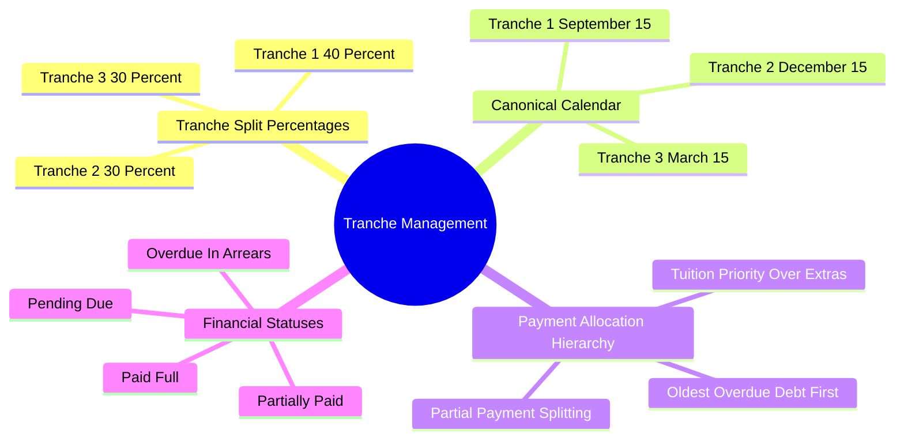

# 03.4 Installment Tranche Scheduling and Reconciliation

#finance #installments #tranches #reconciliation #algeria

Unless paying in full up front via the annual discount option, private school tuition in Algeria is paid in three installment tranches throughout the academic year.

---

## 1. Tranches Mind Map



---

## 2. The 40% - 30% - 30% Tranche Formula

For any annual net tuition amount $T_{\text{net}}$:

$$T_1 = \lfloor T_{\text{net}} \times 0.40 \rfloor$$
$$T_2 = \lfloor T_{\text{net}} \times 0.30 \rfloor$$
$$T_3 = T_{\text{net}} - T_1 - T_2$$

*Note: Calculating $T_3$ as the exact remainder ($T_{\text{net}} - T_1 - T_2$) guarantees that the sum of the three tranches is strictly equal to $T_{\text{net}}$ with zero centime rounding error.*

---

## 3. The 2026-2027 Tranche Calendar

| Tranche | Due Date | Target Period Covered | Default Status on Launch |
| :--- | :--- | :--- | :--- |
| **Tranche 1 (40%)** | September 15, 2026 | Term 1 (Sept – Nov) | Due upon registration |
| **Tranche 2 (30%)** | December 15, 2026 | Term 2 (Dec – Feb) | Pending |
| **Tranche 3 (30%)** | March 15, 2027 | Term 3 (Mar – Jun) | Pending |

---

## 4. Payment Allocation Waterfall Engine

When a parent makes an unallocated lump-sum payment (e.g., $100,000\text{ DZD}$):

```kotlin
fun allocatePayment(
    installments: List<InstallmentEntity>,
    paymentAmountCentimes: Long
): List<InstallmentUpdate> {
    var remaining = paymentAmountCentimes
    val updates = mutableListOf<InstallmentUpdate>()

    // Sort by due date ascending (oldest debts first)
    val sorted = installments.sortedBy { it.dueDate }

    for (inst in sorted) {
        if (remaining <= 0) break
        val unpaid = inst.amountDue - inst.amountPaid
        if (unpaid <= 0) continue

        val paymentToApply = minOf(remaining, unpaid)
        val newAmountPaid = inst.amountPaid + paymentToApply
        val newStatus = if (newAmountPaid >= inst.amountDue) "paid" else "partially_paid"

        updates.add(InstallmentUpdate(inst.id, newAmountPaid, newStatus))
        remaining -= paymentToApply
    }

    return updates
}
```

---

## 5. Key Cross-References

- Baseline Tariffs: [[03.1 Algerian School Pricing and Fee Schedules]]
- Ledger Transactions: [[03.3 Double-Entry Ledger Engine and Invariants]]
- Cash Counter: [[03.5 Cash Counter and Expense Workflows]]
