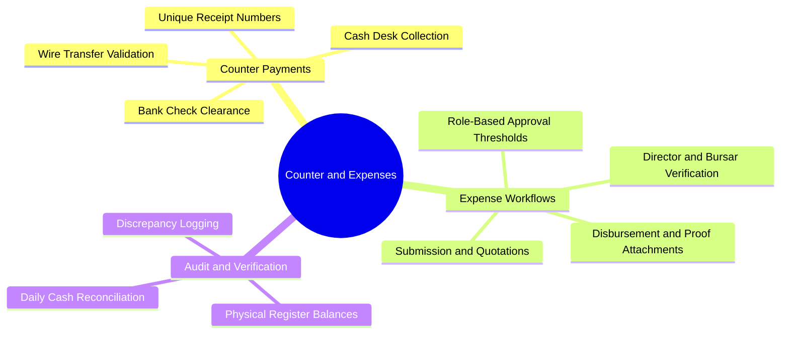

# 03.5 Cash Counter and Expense Workflows

#finance #counter #receipts #expenses #audit #cashier

The **Cash Desk / Counter Payment Module** and **Expense Approval Workflow** manage physical cash handling, official receipt numbers, banking clearance, and disbursement authorizations.

---

## 1. Cash and Expense Mind Map



---

## 2. Receipt Numbering Sequence

Every payment generates a unique, human-readable receipt identifier conforming to the school format:

$$\text{REC}-YYYY-\text{NNNNN} \quad (\text{e.g., }\text{REC-2026-00142})$$

### 2.1 Supported Payment Methods
1. **`cash` (Espèces)**: Immediate clearance into Account `1010 (Cash on Hand)`.
2. **`check` (Chèque)**: Stored in status `pending` until verified cleared by the issuing bank (BNA, CPA, BADR).
3. **`bank_transfer` (Virement bancaire)**: Requires transaction reference code and proof attachment.
4. **`card` (Carte CIB / Edahabia)**: Electronic payment clearance.

---

## 3. Expense Approval Workflow

School operational expenses (repairs, lab equipment, cafeteria supplies, printing) pass through a multi-tier approval pipeline:

```
[Staff Submits Expense Draft + Receipt Photo]
                   │
                   ▼
  [Status: SUBMITTED (Amount < 50,000 DZD?)]
         ├── YES ──► [Accountant Approves] ──► [Status: APPROVED] ──► [Cash Disbursed]
         └── NO  ──► [Director Sign-off Required] ──► [Status: APPROVED] ──► [Disbursed]
```

### 3.1 Ledger Booking upon Disbursement
When an approved expense is paid out in cash:
- **Debit**: `5020 - Operational Supplies Expense`
- **Credit**: `1010 - Cash on Hand`

---

## 4. Key Cross-References

- Double-Entry Engine: [[03.3 Double-Entry Ledger Engine and Invariants]]
- RBAC Approval Rights: [[02.1 Role-Based Access Control Engine]]
