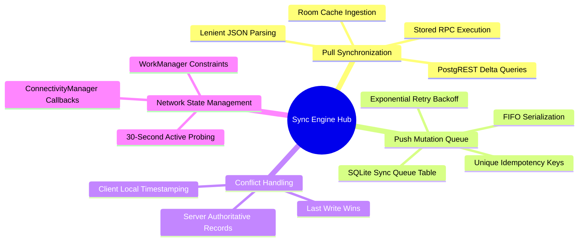

# 04. Master Sync Engine Map of Content (MOC)

#sync #offline-first #workmanager #postgrest #chapter4 #moc

This module covers the core synchronization subsystem responsible for bidirectionally bridging the mobile SQLite database with Supabase PostgreSQL.

---

## 1. Chapter Synchronization Mind Map

---

## 2. Topic Exploration Pathways

- **Pull Synchronization**: Review [[04.1 Pull Sync and PostgREST RPC Synchronization]] for procedures to fetch updated parents, students, payments, and classes from Supabase.
- **Push Mutation Queue**: Study [[04.2 Push Mutation Queue and Idempotency Keys]] to understand how offline writes are safely spooled, retried, and deduplicated.
- **Conflict Resolution**: Read [[04.3 Conflict Resolution and Last-Write-Wins]] for timestamp comparison mechanics and dispute resolution strategies.
- **Network Probing**: Consult [[04.4 Network State Detection and WorkManager Policies]] for details on Android `ConnectivityManager` callbacks and WorkManager scheduling constraints.

---

## 3. Synchronization Invariants

1. **Non-Blocking Execution**: Sync operations must never run on the Main UI thread or block user interactions.
2. **Crash Resilience**: Network timeouts, 502/503 HTTP errors, and malformed JSON payloads must be gracefully caught and logged without crashing the app.
3. **Idempotent Upserts**: Multiple runs of the sync cycle on identical datasets must yield identical database states with zero duplicates.
