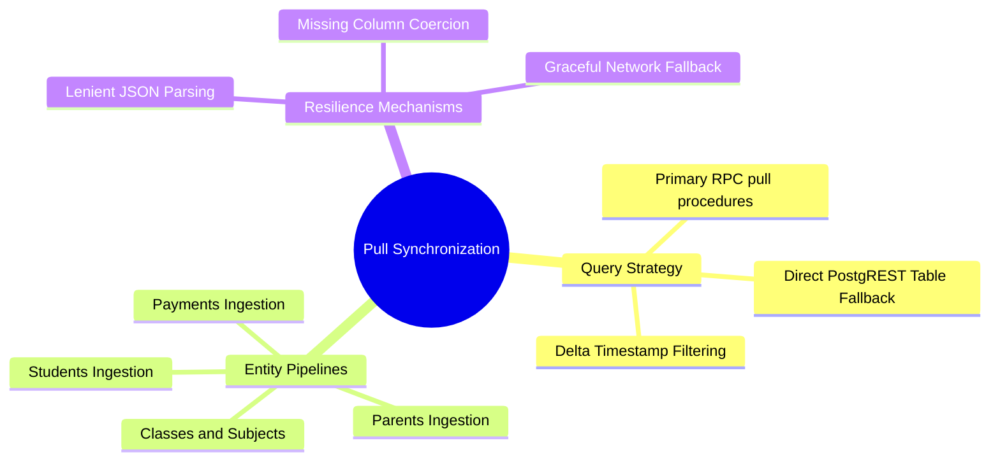

# 04.1 Pull Sync and PostgREST RPC Synchronization

#sync #pull #postgrest #rpc #supabase #room

The **Pull Synchronization Subsystem** downloads new and modified entity rows from Supabase PostgreSQL and upserts them into Room SQLite.

---

## 1. Pull Sync Mind Map



---

## 2. The Dual-Tier Pull Strategy (RPC + Direct Fallback)

To guarantee that sync operates regardless of whether custom stored procedures are installed in the Supabase PostgreSQL environment, `PullSyncRepository` executes a resilient dual-tier fetch:

```
[Start Pull for Entity (e.g. Parents)]
                 │
                 ▼
  [Attempt Stored Procedure RPC] 
  (e.g., rpc("pull_parents_for_sync", params))
                 │
        ┌────────┴────────┐
     SUCCESS            ERROR / 404 / 500
        │                 │
        │                 ▼
        │        [Fallback to Direct Table Query]
        │        (e.g., from("parents").select { limit(1000) })
        │                 │
        └────────┬────────┘
                 ▼
     [Lenient JSON Decoding]
                 ▼
     [Upsert into Room SQLite]
```

---

## 3. Implementation Blueprint

```kotlin
@Singleton
class PullSyncRepository @Inject constructor(
    private val db: ElImtiyazDatabase,
    private val provider: SupabaseClientProvider,
    private val sessionManager: SessionManager,
) {
    private val json = Json {
        ignoreUnknownKeys = true
        coerceInputValues = true
        explicitNulls = false
    }

    suspend fun pullParents(sinceIso: String? = null): Result<Int> = withContext(Dispatchers.IO) {
        if (!NetworkTimeouts.isSupabaseConfigured) {
            return@withContext Result.Err(Errors.server("Supabase not configured"))
        }
        val tenantId = sessionManager.currentTenantId() ?: "ten-elimtiyaz-001"
        try {
            val dtoList: List<ParentDto> = try {
                val params = buildJsonObject {
                    put("p_tenant_id", tenantId)
                    if (sinceIso != null) put("p_since", sinceIso)
                    put("p_limit", 1000)
                }
                val raw = provider.postgrest.rpc("pull_parents_for_sync", params)
                json.decodeFromString(ListSerializer(ParentDto.serializer()), raw.toString())
            } catch (rpcEx: Throwable) {
                // Direct PostgREST table query fallback
                provider.postgrest.from("parents")
                    .select { limit(1000) }
                    .decodeList<ParentDto>()
            }

            for (dto in dtoList) {
                db.parentDao().upsert(dto.toEntity())
            }
            Result.Ok(dtoList.size)
        } catch (e: Exception) {
            Result.Err(Errors.fromException(e))
        }
    }
}
```

---

## 4. Key Cross-References

- Push Subsystem: [[04.2 Push Mutation Queue and Idempotency Keys]]
- Room Entities: [[01.4 Mobile vs Desktop Shared Schema Contract]]
- Sync Worker Exercise: [[07.4 Exercise 3 - Building an Offline-First Sync Worker]]
