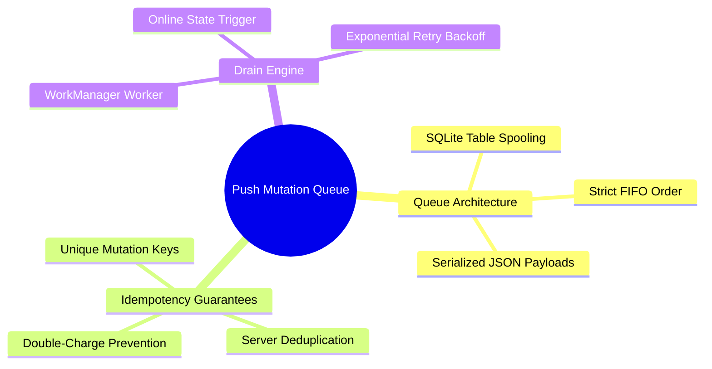

# 04.2 Push Mutation Queue and Idempotency Keys

#sync #queue #idempotency #mutations #offline-first #sqlite

When an action occurs while offline (e.g. recording a tuition payment, registering attendance), it cannot be sent to Supabase immediately. The mutation is saved into a local SQLite table `sync_queue` to ensure zero data loss.

---

## 1. Push Mutation Mind Map



---

## 2. The `sync_queue` Schema

```sql
CREATE TABLE sync_queue (
    id TEXT PRIMARY KEY NOT NULL,          -- UUID v4
    idempotency_key TEXT UNIQUE NOT NULL, -- UUID unique to this mutation attempt
    entity_type TEXT NOT NULL,             -- 'payment', 'parent', 'attendance'
    operation TEXT NOT NULL,               -- 'INSERT', 'UPDATE', 'DELETE'
    payload_json TEXT NOT NULL,            -- Serialized DTO payload
    status TEXT NOT NULL DEFAULT 'pending',-- 'pending', 'in_flight', 'synced', 'failed'
    retry_count INTEGER NOT NULL DEFAULT 0,
    queued_at INTEGER NOT NULL,            -- Epoch timestamp ms
    last_attempt_at INTEGER
);
```

---

## 3. The Idempotency Key Invariant

An **Idempotency Key** is a unique client-generated token attached to every HTTP mutation request header (`X-Idempotency-Key: <key>`) or procedure argument (`p_idempotency_key: <key>`).

### Why is this mandatory?
1. Client sends tuition payment of $112,000\text{ DZD}$.
2. Supabase receives the request, inserts the payment, and commits the database transaction.
3. Before the HTTP `200 OK` response reaches the mobile phone, the cell tower drops connection.
4. The client encounters a network timeout and retries the mutation when reconnected.
5. With an idempotency key, Supabase recognizes the key, skips duplicate insertion, and returns the previous successful result.

---

## 4. Key Cross-References

- Pull Sync: [[04.1 Pull Sync and PostgREST RPC Synchronization]]
- Conflict Handling: [[04.3 Conflict Resolution and Last-Write-Wins]]
- Worker Implementation: [[07.4 Exercise 3 - Building an Offline-First Sync Worker]]
