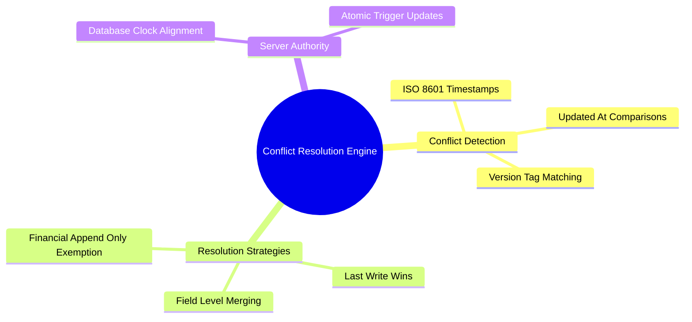

# 04.3 Conflict Resolution and Last-Write-Wins

#sync #conflicts #lww #timestamps #concurrency

In an environment where both Desktop administrative operators and Mobile staff update student and parent records concurrently, data conflicts are inevitable. El-Imtiyaz employs a deterministic **Last-Write-Wins (LWW)** conflict resolution strategy backed by server-authoritative timestamps.

---

## 1. Conflict Resolution Mind Map



---

## 2. The Last-Write-Wins (LWW) Algorithm

For mutable profile entities (Parents, Students, Classes):

$$T_{\text{incoming}} > T_{\text{existing}} \implies \text{Accept Update}$$
$$T_{\text{incoming}} \le T_{\text{existing}} \implies \text{Reject / Discard Older Update}$$

```kotlin
fun resolveParentConflict(local: ParentEntity, remote: ParentDto): ParentEntity {
    val localTime = Instant.parse(local.updatedAt).toEpochMilli()
    val remoteTime = remote.updatedAt?.let { Instant.parse(it).toEpochMilli() } ?: 0L

    return if (remoteTime >= localTime) {
        remote.toEntity()
    } else {
        local // Local edit was made more recently
    }
}
```

---

## 3. The Financial Invariant: Zero Overwrites on Ledgers

> [!CRITICAL]
> **Financial Exception to LWW:**
> Financial transactions (`payments`, `ledger_entries`, `installments`) **NEVER** use Last-Write-Wins because overwriting transactions would corrupt audit balances. Financial records are strictly **append-only**. Conflicts on invoices are resolved by generating compensating debit/credit lines.

---

## 4. Key Cross-References

- Ledger Invariants: [[03.3 Double-Entry Ledger Engine and Invariants]]
- Push Queue: [[04.2 Push Mutation Queue and Idempotency Keys]]
- Pull Mechanics: [[04.1 Pull Sync and PostgREST RPC Synchronization]]
