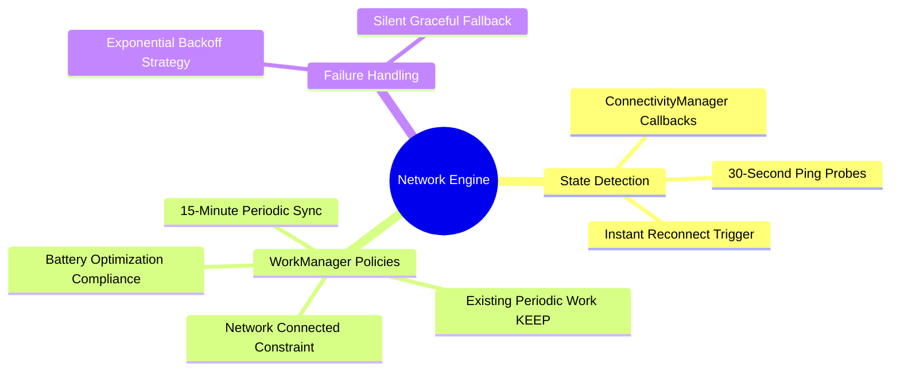

# 04.4 Network State Detection and WorkManager Policies

#sync #workmanager #network #connectivity #android #battery

To prevent wasting device battery and bandwidth while maintaining immediate sync readiness, the system integrates **Android ConnectivityManager** network callbacks with **WorkManager** periodic background constraints.

---

## 1. Network Management Mind Map



---

## 2. Real-Time Network State Observation (`OnlineDetector`)

Standard Android connectivity callbacks can report `NetworkCapabilities.NET_CAPABILITY_INTERNET` even when connected to a captive Wi-Fi portal or non-responsive router. `OnlineDetector` executes a lightweight socket or HTTP probe:

```kotlin
@Singleton
class OnlineDetector @Inject constructor(
    private val context: Context,
) {
    private val _isOnline = MutableStateFlow(true)
    val isOnline: StateFlow<Boolean> = _isOnline

    fun start() {
        val cm = context.getSystemService(Context.CONNECTIVITY_SERVICE) as ConnectivityManager
        val request = NetworkRequest.Builder()
            .addCapability(NetworkCapabilities.NET_CAPABILITY_INTERNET)
            .build()

        cm.registerNetworkCallback(request, object : ConnectivityManager.NetworkCallback() {
            override fun onAvailable(network: Network) {
                _isOnline.value = true
            }

            override fun onLost(network: Network) {
                _isOnline.value = false
            }
        })
    }
}
```

---

## 3. WorkManager Periodic Sync Schedule

```kotlin
@Singleton
class SyncService @Inject constructor(
    private val workManager: WorkManager,
) {
    fun schedulePeriodicSync() {
        val constraints = Constraints.Builder()
            .setRequiredNetworkType(NetworkType.CONNECTED)
            .build()

        val syncRequest = PeriodicWorkRequestBuilder<SyncWorker>(15, TimeUnit.MINUTES)
            .setConstraints(constraints)
            .setBackoffCriteria(BackoffPolicy.EXPONENTIAL, 30, TimeUnit.SECONDS)
            .build()

        workManager.enqueueUniquePeriodicWork(
            "ElImtiyazSyncWork",
            ExistingPeriodicWorkPolicy.KEEP,
            syncRequest
        )
    }
}
```

---

## 4. Key Cross-References

- Pull Sync: [[04.1 Pull Sync and PostgREST RPC Synchronization]]
- App Lifecycle: [[01.2 Offline-First Design Principles]]
- Coding Exercise: [[07.4 Exercise 3 - Building an Offline-First Sync Worker]]
