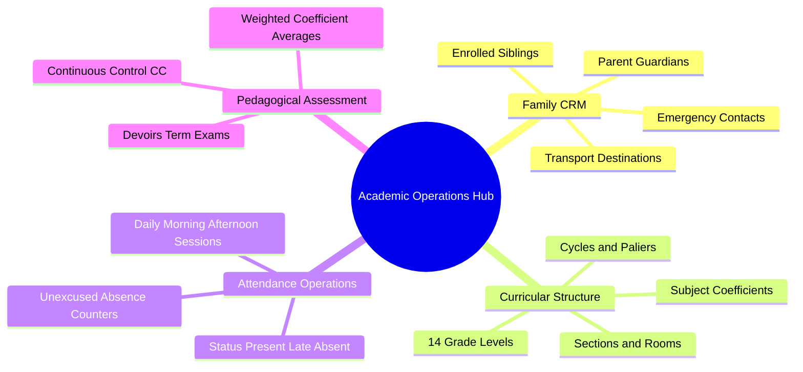

# 05. Master Academic Operations Map of Content (MOC)

#academics #crm #attendance #grading #chapter5 #moc

This module covers the operational and pedagogical foundation of El-Imtiyaz: Family and Student CRM, class structures, attendance tracking, absence thresholds, assessments, and grade evaluations.

---

## 1. Chapter Academic Mind Map

---

## 2. Topic Exploration Pathways

- **Family CRM**: Review [[05.1 Student and Parent Family CRM]] for parent-student relationship modeling, family codes, and contact data.
- **Academic Structure**: Study [[05.2 Class and Grade Level Progression]] for the 4 Algerian school cycles (Préscolaire, Primaire, CEM, Lycée).
- **Attendance Engine**: Read [[05.3 Attendance Tracking and Unexcused Absences]] for attendance recording, justified vs. unjustified absence tracking, and alert triggers.
- **Grading & Bulletins**: Consult [[05.4 Assessment, Grading, and Report Generation]] for coefficient calculations and term report cards.

---

## 3. Core Academic Invariants

1. **Family Clustering**: Every student must be linked to an authoritative Parent guardian record (`parent_id`) to enable automated sibling discounts and centralized billing.
2. **Coefficient Bounds**: Subject coefficients must be positive integers ($1 \le \text{coeff} \le 7$).
3. **Grading Scale**: Standard Algerian academic evaluations score students on a scale of $0.00$ to $20.00$.
