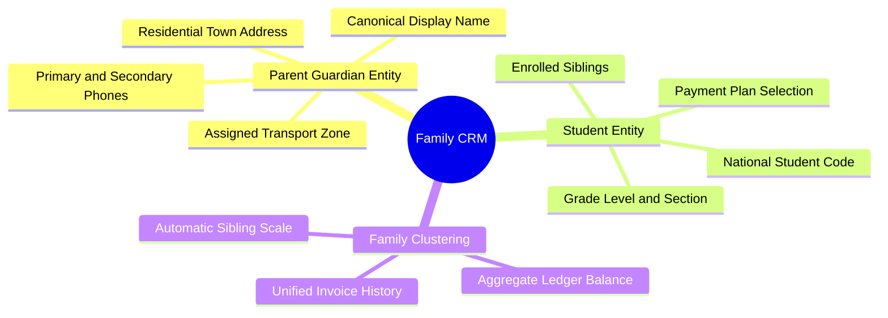

# 05.1 Student and Parent Family CRM

#academics #crm #students #parents #family #relations

The **Family CRM** tracks students and parent guardians as relational family clusters, allowing seamless tuition aggregation, transport assignment, and multi-child communication.

---

## 1. Family CRM Mind Map



---

## 2. Parent-Student Relationship Model

```
       [Parent Entity] (e.g. PAR-2026-0089: BENALI Mohamed)
              │
              ├── [Student 1] (ELV-2026-0104: BENALI Sara, 3AP)
              │
              └── [Student 2] (ELV-2026-0105: BENALI Yanis, 1AM)
```

### 2.1 Benefits of the Family Cluster Architecture
1. **Automated Sibling Discounts**: When registering Yanis, the system queries active siblings sharing `parentId = PAR-2026-0089` and automatically deducts the $5,000\text{ DZD}$ sibling discount.
2. **Unified Financial Ledger**: The accountant views all tuition charges, canteen fees, and payments across all children on a single ledger screen.
3. **Single Contact Point**: Push notifications and SMS alerts are routed to the primary guardian.

---

## 3. Key Cross-References

- Sibling Discount Formula: [[03.2 Five Canonical Discount Calculations]]
- Shared Schema Contract: [[01.4 Mobile vs Desktop Shared Schema Contract]]
- Privacy & Phone Masking: [[02.4 PII Masking and Privacy Enforcement]]
