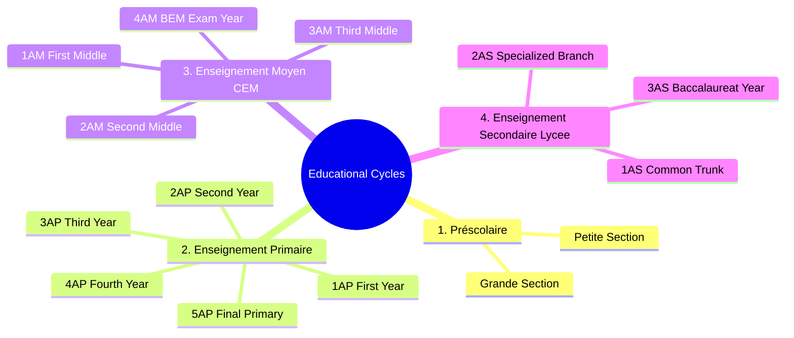

# 05.2 Class and Grade Level Progression

#academics #cycles #classes #grades #algeria

The Algerian educational system is structured into four distinct cycles comprising 14 standard grade levels.

---

## 1. Educational Cycles Mind Map

---

## 2. The 14 Grade Level Specifications

| Cycle | Grade Code | Full Description | Standard Age | Palier Transition Event |
| :--- | :--- | :--- | :--- | :--- |
| **Préscolaire** | `prescolaire_1` | Préscolaire Petite Section | 4 years | — |
| | `prescolaire_2` | Préscolaire Grande Section | 5 years | — |
| **Primaire** | `1ap` | 1ère Année Primaire | 6 years | Cycle entry |
| | `2ap` | 2ème Année Primaire | 7 years | — |
| | `3ap` | 3ème Année Primaire | 8 years | — |
| | `4ap` | 4ème Année Primaire | 9 years | — |
| | `5ap` | 5ème Année Primaire | 10 years | Final primary year |
| **Moyen (CEM)** | `1am` | 1ère Année Moyen | 11 years | **Palier Crossing** (+$10,000\text{ DZD}$ discount) |
| | `2am` | 2ème Année Moyen | 12 years | — |
| | `3am` | 3ème Année Moyen | 13 years | — |
| | `4am` | 4ème Année Moyen (BEM) | 14 years | National Brevet exam |
| **Secondaire (Lycée)** | `1as` | 1ère Année Secondaire | 15 years | **Palier Crossing** (+$10,000\text{ DZD}$ discount) |
| | `2as` | 2ème Année Secondaire | 16 years | Math / Science / Literary streams |
| | `3as` | 3ème Année Secondaire (BAC) | 17 years | National Baccalauréat |

---

## 3. Key Cross-References

- Palier Discount: [[03.2 Five Canonical Discount Calculations]]
- Tuition Schedule by Grade: [[03.1 Algerian School Pricing and Fee Schedules]]
- Assessment Operations: [[05.4 Assessment, Grading, and Report Generation]]
