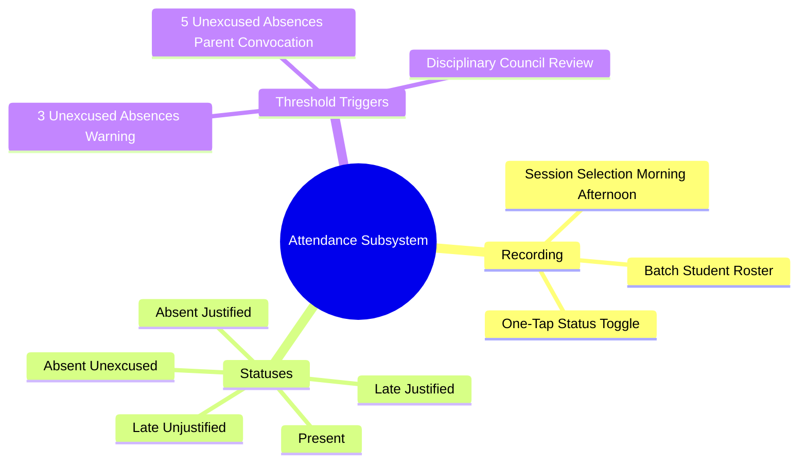

# 05.3 Attendance Tracking and Unexcused Absences

#academics #attendance #absences #workflow #alerts

Daily attendance monitoring is recorded per class session (Morning and Afternoon) by teachers or supervisors. Unexcused absence thresholds automatically trigger pedagogical notifications to directors and parents.

---

## 1. Attendance Workflow Mind Map



---

## 2. Absence Thresholds and Automated Alerts

```kotlin
object AttendanceRules {
    const val THRESHOLD_PARENT_SMS = 1     // Alert sent on 1st unexcused absence
    const val THRESHOLD_DIRECTOR_WARN = 3  // Alert sent to pedagogical director
    const val THRESHOLD_CONVOCATION = 5    // Official parent summons issued
}
```

### 2.1 Database Attendance Entity
```kotlin
@Entity(tableName = "attendance", indices = [Index("studentId"), Index("classId"), Index("date")])
data class AttendanceEntity(
    @PrimaryKey val id: String,
    val tenantId: String,
    val studentId: String,
    val classId: String,
    val date: String,             // ISO date: "2026-10-15"
    val session: String,          // "morning" or "afternoon"
    val status: String,           // "present", "late", "absent_justified", "absent_unexcused"
    val arrivalTime: String?,     // e.g. "08:25"
    val note: String?,
    val recordedBy: String,
    val recordedBy_name: String,
    val recordedAt: String,
)
```

---

## 3. Key Cross-References

- Push Notifications: [[02.2 Session State and Token Refresh Lifecycle]]
- Student CRM: [[05.1 Student and Parent Family CRM]]
- Teacher Roles: [[02.1 Role-Based Access Control Engine]]
