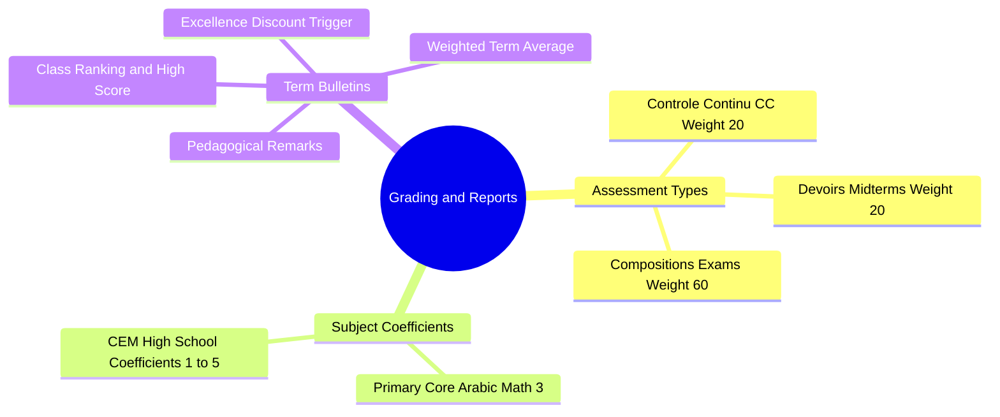

# 05.4 Assessment, Grading, and Report Generation

#academics #grading #assessments #bulletins #report-cards #algeria

The assessment engine calculates weighted averages across subjects, continuous evaluation (*Contrôle Continu*), midterm tests (*Devoirs*), and term exams (*Compositions*) on a $0.00$ to $20.00$ scale.

---

## 1. Grading Engine Mind Map

---

## 2. Term Subject Average Formula

In the Algerian national curriculum, a student's final term mark in a subject $S$ is computed using the standard weighted formula:

$$\text{Subject Average} = \frac{\text{CC} + \text{Devoir} + (\text{Composition} \times 2)}{4}$$

### 2.1 General Term Cycle Average (Moyenne Générale)
Across $M$ subjects with positive integer coefficients $c_1, c_2, \dots, c_M$:

$$\text{Moyenne Générale} = \frac{\sum_{i=1}^{M} (\text{Subject Average}_i \times c_i)}{\sum_{i=1}^{M} c_i}$$

---

## 3. Academic Excellence Discount Hook

When term report cards are finalized:
1. The student achieving the highest `Moyenne Générale` within their cycle/palier is awarded the **Academic Excellence Badge**.
2. The financial engine flags the student for **Discount 4 ($-10\%$ tuition reduction)** on the subsequent academic period.

---

## 4. Key Cross-References

- Excellence Discount: [[03.2 Five Canonical Discount Calculations]]
- Grade Cycles: [[05.2 Class and Grade Level Progression]]
- UI Cards: [[06.3 Adaptive Layouts and Touch Target Compliance]]
