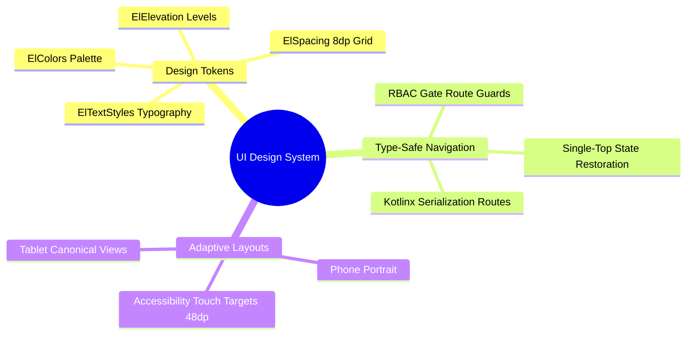

# 06. Master UI Design System Map of Content (MOC)

#ui #jetpack-compose #design-system #chapter6 #moc #android

This module details the design tokens, component architecture, type-safe navigation graph, and accessibility guidelines powering the El-Imtiyaz Android client.

---

## 1. Chapter UI Mind Map

---

## 2. Topic Exploration Pathways

- **Design Tokens**: Review [[06.1 Design Tokens and CompositionLocals]] for colors, elevation, typography tokens, and CompositionLocal hierarchy.
- **Type-Safe Routing**: Study [[06.2 Navigation Compose and Type-Safe Routing]] for `@Serializable` navigation destinations and deep links.
- **Adaptive Layouts**: Read [[06.3 Adaptive Layouts and Touch Target Compliance]] for responsive tablet ergonomics and 48dp touch targets.

---

## 3. UI Invariants and Standards

1. **No Hardcoded Hex Colors**: All composable styling must reference `MaterialTheme.colorScheme` or `LocalElColors.current`.
2. **Strict 8dp Grid**: Margins and paddings must align to multiples of 8dp (4dp, 8dp, 16dp, 24dp, 32dp).
3. **Accessibility Compliance**: All interactive buttons, icon chips, and input fields must satisfy minimum touch bounding boxes of $48\text{dp} \times 48\text{dp}$.
