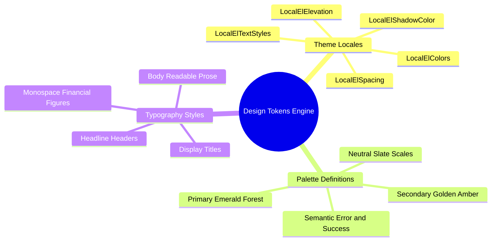

# 06.1 Design Tokens and CompositionLocals

#ui #tokens #composition-local #jetpack-compose #theme

The UI system uses custom design tokens injected down the Composable tree via **CompositionLocals**. This ensures uniform branding, effortless dark-mode switching, and zero runtime crashes.

---

## 1. Design Tokens Mind Map



---

## 2. The Complete CompositionLocal Hierarchy

In `ElImtiyazTheme.kt`, all essential design tokens are bound inside a unified `CompositionLocalProvider`:

```kotlin
@Composable
fun ElImtiyazTheme(
    darkTheme: Boolean = isSystemInDarkTheme(),
    content: @Composable () -> Unit
) {
    val colors = if (darkTheme) DarkElColors else LightElColors
    val spacing = ElSpacing()
    val elevation = ElElevation()
    val textStyles = ElTextStyles()

    CompositionLocalProvider(
        LocalElColors provides colors,
        LocalElSpacing provides spacing,
        LocalElElevation provides elevation,
        LocalElTextStyles provides textStyles,
        LocalElBorders provides ElBorders(),
        LocalElMotion provides ElMotion(),
        LocalElShadowColor provides colors.shadow,
    ) {
        MaterialTheme(
            colorScheme = colors.toMaterial3ColorScheme(),
            content = content
        )
    }
}
```

---

## 3. Important Design System Reminder

> [!CAUTION]
> **Crash Prevention Notice:**
> Any custom design system component (such as `ElScaffold`, `ElButton`, or `ElCard`) calling `LocalElColors.current` requires `ElImtiyazTheme` at the root of `MainActivity`. Omitting this provider causes runtime `IllegalStateException: CompositionLocal LocalElColors not provided`.

---

## 4. Key Cross-References

- UI Architecture: [[01.1 System Architecture Overview]]
- Navigation Host: [[06.2 Navigation Compose and Type-Safe Routing]]
- Layout Ergonomics: [[06.3 Adaptive Layouts and Touch Target Compliance]]
