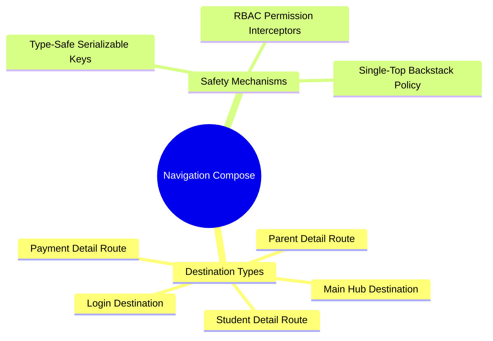

# 06.2 Navigation Compose and Type-Safe Routing

#ui #navigation #kotlinx-serialization #routes #jetpack-compose

Navigation in El-Imtiyaz is implemented using **Navigation Compose 2.8+** with `@Serializable` Kotlin classes and objects, eliminating stringly-typed URLs and argument parsing bugs.

---

## 1. Navigation Mind Map



---

## 2. Type-Safe Route Definitions

```kotlin
@Serializable
sealed interface Routes {
    @Serializable
    data object Login : Routes

    @Serializable
    data object Main : Routes

    @Serializable
    data class ParentDetail(val parentId: String) : Routes

    @Serializable
    data class StudentDetail(val studentId: String) : Routes

    @Serializable
    data class PaymentDetail(val paymentId: String) : Routes

    @Serializable
    data object PermissionDenied : Routes
}
```

---

## 3. Extracting Route Arguments Safely

```kotlin
composable<Routes.ParentDetail> { backStackEntry ->
    val route: Routes.ParentDetail = backStackEntry.toRoute()
    ParentDetailScreen(parentId = route.parentId)
}
```

---

## 4. Key Cross-References

- RBAC Guards: [[02.1 Role-Based Access Control Engine]]
- Session Restoral: [[02.2 Session State and Token Refresh Lifecycle]]
