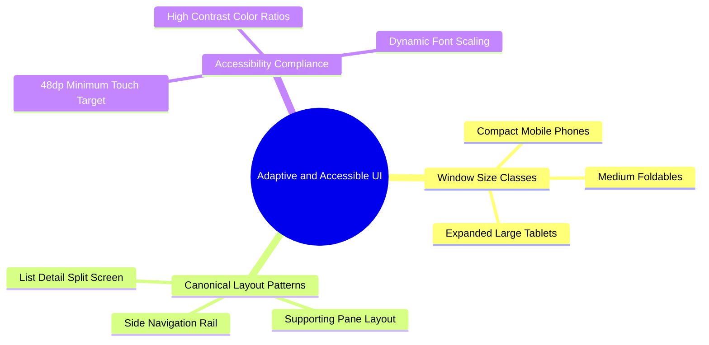

# 06.3 Adaptive Layouts and Touch Target Compliance

#ui #adaptive #responsive #tablets #accessibility #touch-targets

The mobile application is optimized for both one-handed handheld smartphones and widescreen Android tablets used at reception desks and staff offices.

---

## 1. Adaptive Design Mind Map



---

## 2. Touch Target Size Compliance

Every interactive clickable element (`Button`, `IconButton`, `Checkbox`, `DropdownMenu`) must satisfy the Android Accessibility standard of **$48\text{dp} \times 48\text{dp}$**:

```kotlin
IconButton(
    onClick = { /* action */ },
    modifier = Modifier
        .size(48.dp)
        .testTag("action_button")
) {
    Icon(
        imageVector = Icons.Default.Check,
        contentDescription = "Confirm Payment"
    )
}
```

---

## 3. Key Cross-References

- Design Tokens: [[06.1 Design Tokens and CompositionLocals]]
- System Overview: [[01.1 System Architecture Overview]]
