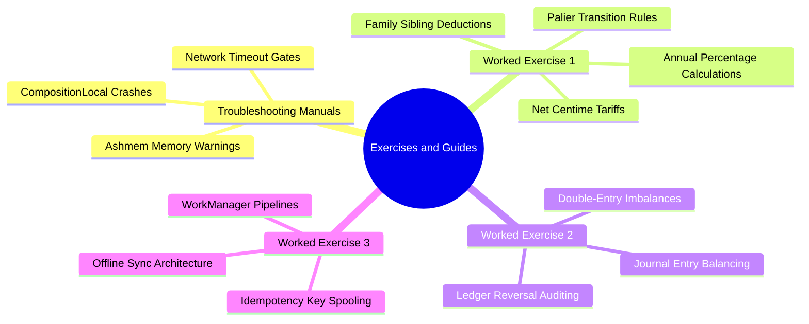

# 07. Master Guide and Exercises Map of Content (MOC)

#exercises #troubleshooting #guide #chapter7 #moc #study-guide

This chapter contains step-by-step troubleshooting manuals, worked computational exercises, and software engineering problem sets designed to solidify mastery of the El-Imtiyaz platform.

---

## 1. Chapter Exercises Mind Map

---

## 2. Topic Exploration Pathways

- **Diagnostic Manual**: Read [[07.1 Common Pitfalls and Memory Driver Warnings]] for root-cause analysis of Android system logs (`ashmem`, `EGL`, `NetworkTimeouts`).
- **Computational Problem 1**: Work through [[07.2 Exercise 1 - Calculating Sibling and Palier Discounts]] for a multi-child tuition calculation with discount stacking.
- **Accounting Problem 2**: Solve [[07.3 Exercise 2 - Reconciling Double-Entry Ledger Imbalances]] to diagnose and repair an unbalanced general ledger with non-destructive entries.
- **Engineering Problem 3**: Implement [[07.4 Exercise 3 - Building an Offline-First Sync Worker]] for an end-to-end Kotlin coroutine WorkManager worker.

---

## 3. How to Approach the Exercises

1. **Read the Context and Baseline Rules**: Refresh domain constraints from Chapters 3 and 4 before starting.
2. **Attempt Independently**: Calculate the values or design the architecture before checking the detailed step-by-step solution.
3. **Review the "Student Traps and Pitfalls"**: Ensure you understand why naive shortcuts (like floating-point math or database deletions) cause severe bugs in production.
