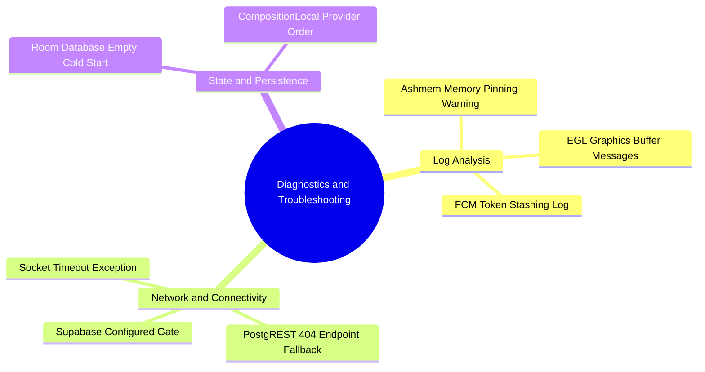

# 07.1 Common Pitfalls and Memory Driver Warnings

#troubleshooting #android #logs #ashmem #network #debugging

This guide provides diagnostic procedures and root-cause explanations for common log messages and edge cases in the Android system.

---

## 1. Troubleshooting Mind Map



---

## 2. Issue 1: `E/ashmem: Pinning is deprecated since Android Q`

### Symptom in Android Logcat:
```
error 0: 08-14 17:36:30.181 9378 E/ashmem : Pinning is deprecated since Android Q. Please use trim or other methods.
```

### Root Cause Analysis:
- `ashmem` (Android Shared Memory) is a low-level Linux kernel driver used by Android's graphics compositor (SurfaceFlinger and Skia rendering pipeline).
- When running inside cloud-based emulators or virtualized display pipelines on Android API 29+ (Android Q), the graphic driver logs this informational warning when allocating bitmap framebuffers.
- **Impact on App Logic**: **Zero**. This is not an application crash or bug; it is an emulator OS-level notice.

---

## 3. Issue 2: `Supabase not configured — FCM token logged locally`

### Symptom:
Data appears to be in local/demo mode and Supabase network calls are skipped.

### Root Cause Analysis:
`NetworkTimeouts.isSupabaseConfigured` evaluates whether `BuildConfig.SUPABASE_URL` and `BuildConfig.SUPABASE_ANON_KEY` are valid non-placeholder strings. If `.env` contains placeholder text or missing keys, the app safely protects against infinite HTTP hangs by remaining in local mode.

### Resolution:
Ensure `.env` contains live credentials:
```properties
SUPABASE_URL=https://hkvkefubghbbotgnteir.supabase.co
SUPABASE_PUBLISHABLE_KEY=sb_publishable_YJR7u7BgicV1QZRnc1WdHA_BkGzfVgo
```

---

## 4. Key Cross-References

- Pull Sync Fallback: [[04.1 Pull Sync and PostgREST RPC Synchronization]]
- App Architecture: [[01.1 System Architecture Overview]]
