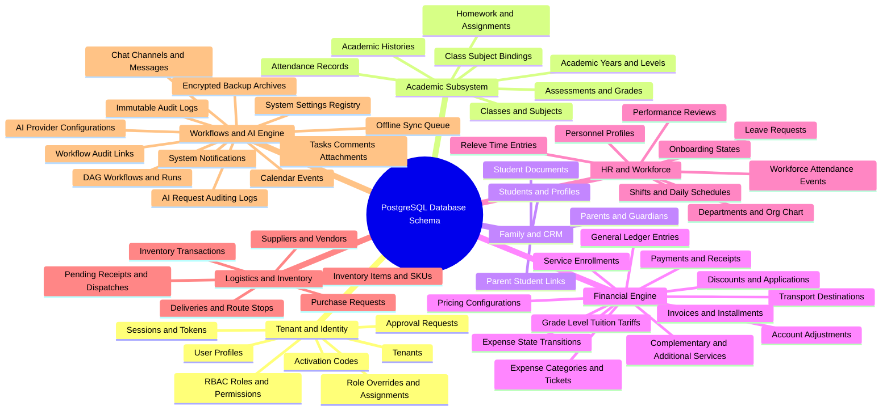

# 08. Master Database Schema Map of Content (MOC)

#database #schema #postgres #supabase #sql #relational-model #chapter8 #moc

This module is the comprehensive, exhaustive technical reference for the entire **PostgreSQL Relational Database Schema** of the El-Imtiyaz platform. It documents all 45+ database tables, their relational constraints, foreign keys, enum checks, indexing strategies, and cross-module integration rules.

---

## 1. Complete Database Schema Mind Map

---

## 2. Topic Exploration Pathways

- **Identity & Security Tables**: Study [[08.1 Core Multi-Tenancy, Users, and RBAC Schema]] for `tenants`, `user_profiles`, `account_approval_requests`, `sessions`, `roles`, `permissions`, `role_permissions`, `tenant_role_overrides`, `role_assignments`, `activation_codes`, and `device_tokens`.
- **Academic Domain Tables**: Review [[08.2 Academic Structure, Classes, and Grading Schema]] for `academic_years`, `academic_levels`, `classes`, `subjects`, `class_subjects`, `assessments`, `grades`, `attendance_records`, `homework`, `homework_assignments`, and `academic_history`.
- **CRM & Student Records**: Read [[08.3 CRM, Students, and Family Relationships Schema]] for `parents`, `students`, `parent_student_links`, and `student_documents`.
- **Financial & Ledger Tables**: Consult [[08.4 Financial Engine, Tariffs, Invoices, and Ledger Schema]] for `pricing_configs`, `grade_level_tuition`, `transport_destinations`, `complementary_services`, `additional_services`, `discounts`, `discount_applications`, `service_enrollments`, `invoices`, `installments`, `payments`, `account_adjustments`, `receipts`, `ledger_entries`, `expense_categories`, `expense_tickets`, and `expense_state_transitions`.
- **HR & Workforce Operations**: Explore [[08.5 HR, Workforce Attendance, Releve, and Shifts Schema]] for `personnel`, `departments`, `shifts`, `schedules`, `workforce_attendance_events`, `releve_entries`, `leave_requests`, `performance_reviews`, and `onboarding_states`.
- **Logistics & Procurement**: Examine [[08.6 Logistics, Inventory, Procurement, and Suppliers Schema]] for `suppliers`, `purchase_requests`, `deliveries`, `inventory_items`, `inventory_transactions`, `pending_receipts`, and `pending_dispatches`.
- **Workflow, Tasks, Chat & System Logs**: Study [[08.7 Tasks, Workflows, Chat, AI, and System Infrastructure Schema]] for `tasks`, `task_comments`, `task_attachments`, `workflows`, `workflow_runs`, `workflow_audit_links`, `chat_channels`, `chat_messages`, `ai_provider_configs`, `ai_request_logs`, `calendar_events`, `notifications`, `backup_archives`, `audit_logs`, `system_settings`, and `sync_queue`.

---

## 3. Core Database Invariants

1. **Universal Multi-Tenancy**: Every operational table is scoped by a mandatory foreign key `tenant_id REFERENCES public.tenants(id)`.
2. **Cryptographic Primary Keys**: All primary keys default to standard UUIDs (`uuid DEFAULT gen_uuid()` or `gen_random_uuid()`), preventing sequential enumeration and supporting offline client generation.
3. **Auditability**: All mutating actions record timestamps (`created_at`, `updated_at`, `deleted_at`) and are mirrored in `public.audit_logs`.
