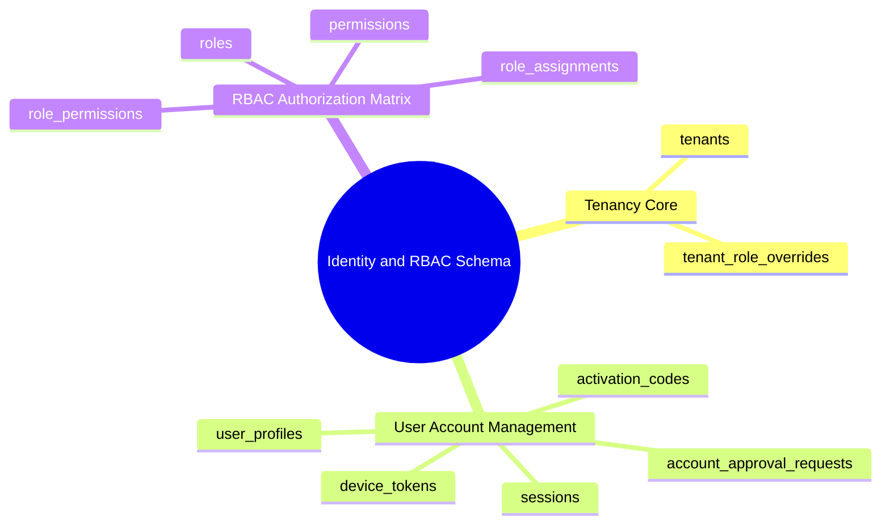

# 08.1 Core Multi-Tenancy, Users, and RBAC Schema

#database #schema #postgres #identity #security #rbac #multi-tenancy #chapter8

This document outlines the database schema, relational constraints, foreign key cascades, and data models governing Multi-Tenancy, User Profiles, Role-Based Access Control (RBAC), Authentication, and Device Tokens in the El-Imtiyaz School Management System.

---

## 1. Identity & RBAC Conceptual Mind Map



---

## 2. Table Specifications and DDL Definitions

### 2.1 `tenants`
The root entity representing an independent school or educational institution within the multi-tenant SaaS architecture.

```sql
CREATE TABLE public.tenants (
    id UUID PRIMARY KEY DEFAULT gen_random_uuid(),
    code VARCHAR(50) NOT NULL UNIQUE,
    name VARCHAR(255) NOT NULL,
    subdomain VARCHAR(100) NOT NULL UNIQUE,
    logo_url TEXT,
    contact_email VARCHAR(255),
    contact_phone VARCHAR(50),
    currency_code VARCHAR(3) DEFAULT 'DZD',
    timezone VARCHAR(50) DEFAULT 'Africa/Algiers',
    status VARCHAR(30) DEFAULT 'ACTIVE' CHECK (status IN ('ACTIVE', 'SUSPENDED', 'TRIAL', 'ARCHIVED')),
    settings JSONB DEFAULT '{}'::jsonb,
    created_at TIMESTAMPTZ NOT NULL DEFAULT clock_timestamp(),
    updated_at TIMESTAMPTZ NOT NULL DEFAULT clock_timestamp(),
    deleted_at TIMESTAMPTZ
);

CREATE INDEX idx_tenants_subdomain ON public.tenants(subdomain);
CREATE INDEX idx_tenants_status ON public.tenants(status) WHERE deleted_at IS NULL;
```

---

### 2.2 `user_profiles`
Stores profile metadata, localized preferences, and security state for all authenticated accounts across tenants.

```sql
CREATE TABLE public.user_profiles (
    id UUID PRIMARY KEY REFERENCES auth.users(id) ON DELETE CASCADE,
    tenant_id UUID NOT NULL REFERENCES public.tenants(id) ON DELETE CASCADE,
    email VARCHAR(255) NOT NULL,
    phone_number VARCHAR(50),
    first_name VARCHAR(100) NOT NULL,
    last_name VARCHAR(100) NOT NULL,
    full_name VARCHAR(200) GENERATED ALWAYS AS (first_name || ' ' || last_name) STORED,
    national_id VARCHAR(50),
    avatar_url TEXT,
    language_preference VARCHAR(10) DEFAULT 'ar' CHECK (language_preference IN ('ar', 'fr', 'en')),
    status VARCHAR(30) DEFAULT 'PENDING_APPROVAL' CHECK (status IN ('ACTIVE', 'PENDING_APPROVAL', 'SUSPENDED', 'DEACTIVATED')),
    is_superadmin BOOLEAN DEFAULT FALSE,
    mfa_enabled BOOLEAN DEFAULT FALSE,
    last_login_at TIMESTAMPTZ,
    created_at TIMESTAMPTZ NOT NULL DEFAULT clock_timestamp(),
    updated_at TIMESTAMPTZ NOT NULL DEFAULT clock_timestamp(),
    deleted_at TIMESTAMPTZ,
    CONSTRAINT uq_tenant_user_email UNIQUE (tenant_id, email)
);

CREATE INDEX idx_user_profiles_tenant ON public.user_profiles(tenant_id);
CREATE INDEX idx_user_profiles_status ON public.user_profiles(tenant_id, status);
CREATE INDEX idx_user_profiles_phone ON public.user_profiles(phone_number);
```

---

### 2.3 `account_approval_requests`
Maintains the audit queue of self-registered staff or parent accounts awaiting administrative verification.

```sql
CREATE TABLE public.account_approval_requests (
    id UUID PRIMARY KEY DEFAULT gen_random_uuid(),
    tenant_id UUID NOT NULL REFERENCES public.tenants(id) ON DELETE CASCADE,
    user_id UUID NOT NULL REFERENCES public.user_profiles(id) ON DELETE CASCADE,
    requested_role VARCHAR(50) NOT NULL,
    status VARCHAR(30) DEFAULT 'PENDING' CHECK (status IN ('PENDING', 'APPROVED', 'REJECTED')),
    reviewed_by UUID REFERENCES public.user_profiles(id),
    reviewed_at TIMESTAMPTZ,
    rejection_reason TEXT,
    metadata JSONB DEFAULT '{}'::jsonb,
    created_at TIMESTAMPTZ NOT NULL DEFAULT clock_timestamp(),
    updated_at TIMESTAMPTZ NOT NULL DEFAULT clock_timestamp()
);

CREATE INDEX idx_account_approval_tenant_status ON public.account_approval_requests(tenant_id, status);
```

---

### 2.4 `roles` and `permissions`
The backbone of granular Role-Based Access Control.

```sql
CREATE TABLE public.roles (
    id UUID PRIMARY KEY DEFAULT gen_random_uuid(),
    code VARCHAR(50) NOT NULL UNIQUE,
    name VARCHAR(100) NOT NULL,
    description TEXT,
    is_system_role BOOLEAN DEFAULT FALSE,
    created_at TIMESTAMPTZ NOT NULL DEFAULT clock_timestamp(),
    updated_at TIMESTAMPTZ NOT NULL DEFAULT clock_timestamp()
);

CREATE TABLE public.permissions (
    id UUID PRIMARY KEY DEFAULT gen_random_uuid(),
    code VARCHAR(100) NOT NULL UNIQUE,
    category VARCHAR(50) NOT NULL,
    name VARCHAR(150) NOT NULL,
    description TEXT,
    created_at TIMESTAMPTZ NOT NULL DEFAULT clock_timestamp()
);

CREATE TABLE public.role_permissions (
    role_id UUID NOT NULL REFERENCES public.roles(id) ON DELETE CASCADE,
    permission_id UUID NOT NULL REFERENCES public.permissions(id) ON DELETE CASCADE,
    PRIMARY KEY (role_id, permission_id)
);
```

---

### 2.5 `tenant_role_overrides` and `role_assignments`
Provides multi-tenant role overrides and binds user accounts to designated system roles.

```sql
CREATE TABLE public.tenant_role_overrides (
    id UUID PRIMARY KEY DEFAULT gen_random_uuid(),
    tenant_id UUID NOT NULL REFERENCES public.tenants(id) ON DELETE CASCADE,
    role_id UUID NOT NULL REFERENCES public.roles(id) ON DELETE CASCADE,
    permission_id UUID NOT NULL REFERENCES public.permissions(id) ON DELETE CASCADE,
    is_granted BOOLEAN NOT NULL DEFAULT TRUE,
    created_at TIMESTAMPTZ NOT NULL DEFAULT clock_timestamp(),
    CONSTRAINT uq_tenant_role_perm_override UNIQUE (tenant_id, role_id, permission_id)
);

CREATE TABLE public.role_assignments (
    id UUID PRIMARY KEY DEFAULT gen_random_uuid(),
    tenant_id UUID NOT NULL REFERENCES public.tenants(id) ON DELETE CASCADE,
    user_id UUID NOT NULL REFERENCES public.user_profiles(id) ON DELETE CASCADE,
    role_id UUID NOT NULL REFERENCES public.roles(id) ON DELETE CASCADE,
    assigned_by UUID REFERENCES public.user_profiles(id),
    expires_at TIMESTAMPTZ,
    created_at TIMESTAMPTZ NOT NULL DEFAULT clock_timestamp(),
    CONSTRAINT uq_user_tenant_role UNIQUE (tenant_id, user_id, role_id)
);

CREATE INDEX idx_role_assignments_user ON public.role_assignments(user_id, tenant_id);
```

---

### 2.6 `activation_codes` and `device_tokens`

```sql
CREATE TABLE public.activation_codes (
    id UUID PRIMARY KEY DEFAULT gen_random_uuid(),
    tenant_id UUID NOT NULL REFERENCES public.tenants(id) ON DELETE CASCADE,
    code VARCHAR(32) NOT NULL UNIQUE,
    target_role VARCHAR(50) NOT NULL,
    claimed_by UUID REFERENCES public.user_profiles(id),
    expires_at TIMESTAMPTZ NOT NULL,
    is_used BOOLEAN DEFAULT FALSE,
    metadata JSONB DEFAULT '{}'::jsonb,
    created_at TIMESTAMPTZ NOT NULL DEFAULT clock_timestamp()
);

CREATE TABLE public.device_tokens (
    id UUID PRIMARY KEY DEFAULT gen_random_uuid(),
    tenant_id UUID NOT NULL REFERENCES public.tenants(id) ON DELETE CASCADE,
    user_id UUID NOT NULL REFERENCES public.user_profiles(id) ON DELETE CASCADE,
    fcm_token TEXT NOT NULL,
    device_name VARCHAR(100),
    platform VARCHAR(20) CHECK (platform IN ('ANDROID', 'IOS', 'WEB')),
    last_seen_at TIMESTAMPTZ DEFAULT clock_timestamp(),
    created_at TIMESTAMPTZ NOT NULL DEFAULT clock_timestamp(),
    CONSTRAINT uq_user_fcm_token UNIQUE (user_id, fcm_token)
);

CREATE INDEX idx_device_tokens_user ON public.device_tokens(tenant_id, user_id);
```

---

## 3. Related System Documentation

- [[02.1 Multi-Tenancy Architecture and Tenant Isolation]]
- [[02.2 Role-Based Access Control and Permission Matrix]]
- [[08. Master Database Schema MOC]]
