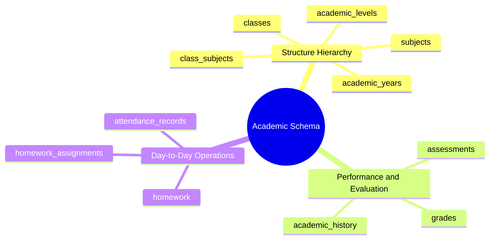

# 08.2 Academic Structure, Classes, and Grading Schema

#database #schema #postgres #academic #grading #attendance #classes #chapter8

This document details the relational database schema, integrity constraints, and indexing architecture for academic operational structures including years, levels, sections, subjects, assessment grading engines, attendance logs, and homework.

---

## 1. Academic Structure Conceptual Mind Map



---

## 2. Table Specifications and DDL Definitions

### 2.1 `academic_years` and `academic_levels`

```sql
CREATE TABLE public.academic_years (
    id UUID PRIMARY KEY DEFAULT gen_random_uuid(),
    tenant_id UUID NOT NULL REFERENCES public.tenants(id) ON DELETE CASCADE,
    name VARCHAR(50) NOT NULL, -- e.g., '2024-2025'
    start_date DATE NOT NULL,
    end_date DATE NOT NULL,
    is_current BOOLEAN DEFAULT FALSE,
    created_at TIMESTAMPTZ NOT NULL DEFAULT clock_timestamp(),
    updated_at TIMESTAMPTZ NOT NULL DEFAULT clock_timestamp(),
    CONSTRAINT chk_academic_year_dates CHECK (end_date > start_date),
    CONSTRAINT uq_tenant_academic_year_name UNIQUE (tenant_id, name)
);

CREATE TABLE public.academic_levels (
    id UUID PRIMARY KEY DEFAULT gen_random_uuid(),
    tenant_id UUID NOT NULL REFERENCES public.tenants(id) ON DELETE CASCADE,
    code VARCHAR(50) NOT NULL, -- e.g., 'PRI_1', 'CEM_4', 'LYC_3'
    name VARCHAR(100) NOT NULL,
    cycle VARCHAR(50) NOT NULL CHECK (cycle IN ('PRIMARY', 'MIDDLE_SCHOOL', 'HIGH_SCHOOL', 'KINDERGARTEN')),
    sequence_order INT NOT NULL,
    created_at TIMESTAMPTZ NOT NULL DEFAULT clock_timestamp(),
    CONSTRAINT uq_tenant_level_code UNIQUE (tenant_id, code)
);

CREATE INDEX idx_academic_levels_order ON public.academic_levels(tenant_id, sequence_order);
```

---

### 2.2 `classes` and `subjects`

```sql
CREATE TABLE public.classes (
    id UUID PRIMARY KEY DEFAULT gen_random_uuid(),
    tenant_id UUID NOT NULL REFERENCES public.tenants(id) ON DELETE CASCADE,
    academic_year_id UUID NOT NULL REFERENCES public.academic_years(id) ON DELETE RESTRICT,
    academic_level_id UUID NOT NULL REFERENCES public.academic_levels(id) ON DELETE RESTRICT,
    name VARCHAR(50) NOT NULL, -- e.g., '1A', '3AS-Math'
    room_number VARCHAR(30),
    max_capacity INT DEFAULT 30,
    main_teacher_id UUID REFERENCES public.user_profiles(id),
    created_at TIMESTAMPTZ NOT NULL DEFAULT clock_timestamp(),
    updated_at TIMESTAMPTZ NOT NULL DEFAULT clock_timestamp(),
    CONSTRAINT uq_tenant_year_class_name UNIQUE (tenant_id, academic_year_id, name)
);

CREATE TABLE public.subjects (
    id UUID PRIMARY KEY DEFAULT gen_random_uuid(),
    tenant_id UUID NOT NULL REFERENCES public.tenants(id) ON DELETE CASCADE,
    code VARCHAR(50) NOT NULL,
    name VARCHAR(100) NOT NULL,
    default_coefficient NUMERIC(4,2) DEFAULT 1.00,
    created_at TIMESTAMPTZ NOT NULL DEFAULT clock_timestamp(),
    CONSTRAINT uq_tenant_subject_code UNIQUE (tenant_id, code)
);

CREATE TABLE public.class_subjects (
    id UUID PRIMARY KEY DEFAULT gen_random_uuid(),
    tenant_id UUID NOT NULL REFERENCES public.tenants(id) ON DELETE CASCADE,
    class_id UUID NOT NULL REFERENCES public.classes(id) ON DELETE CASCADE,
    subject_id UUID NOT NULL REFERENCES public.subjects(id) ON DELETE CASCADE,
    teacher_id UUID REFERENCES public.user_profiles(id),
    coefficient NUMERIC(4,2) NOT NULL DEFAULT 1.00,
    created_at TIMESTAMPTZ NOT NULL DEFAULT clock_timestamp(),
    CONSTRAINT uq_class_subject UNIQUE (class_id, subject_id)
);
```

---

### 2.3 `assessments` and `grades`

```sql
CREATE TABLE public.assessments (
    id UUID PRIMARY KEY DEFAULT gen_random_uuid(),
    tenant_id UUID NOT NULL REFERENCES public.tenants(id) ON DELETE CASCADE,
    class_subject_id UUID NOT NULL REFERENCES public.class_subjects(id) ON DELETE CASCADE,
    title VARCHAR(150) NOT NULL,
    type VARCHAR(30) NOT NULL CHECK (type IN ('EXAM', 'TEST', 'QUIZ', 'HOMEWORK', 'PROJECT')),
    trimester INT NOT NULL CHECK (trimester IN (1, 2, 3)),
    max_score NUMERIC(5,2) DEFAULT 20.00,
    weight NUMERIC(4,2) DEFAULT 1.00,
    date_conducted DATE NOT NULL,
    created_at TIMESTAMPTZ NOT NULL DEFAULT clock_timestamp()
);

CREATE TABLE public.grades (
    id UUID PRIMARY KEY DEFAULT gen_random_uuid(),
    tenant_id UUID NOT NULL REFERENCES public.tenants(id) ON DELETE CASCADE,
    assessment_id UUID NOT NULL REFERENCES public.assessments(id) ON DELETE CASCADE,
    student_id UUID NOT NULL, -- references students table
    score NUMERIC(5,2) NOT NULL,
    remarks TEXT,
    graded_by UUID REFERENCES public.user_profiles(id),
    created_at TIMESTAMPTZ NOT NULL DEFAULT clock_timestamp(),
    updated_at TIMESTAMPTZ NOT NULL DEFAULT clock_timestamp(),
    CONSTRAINT uq_assessment_student_grade UNIQUE (assessment_id, student_id)
);

CREATE INDEX idx_grades_student ON public.grades(tenant_id, student_id);
```

---

### 2.4 `attendance_records` and `homework`

```sql
CREATE TABLE public.attendance_records (
    id UUID PRIMARY KEY DEFAULT gen_random_uuid(),
    tenant_id UUID NOT NULL REFERENCES public.tenants(id) ON DELETE CASCADE,
    class_id UUID NOT NULL REFERENCES public.classes(id) ON DELETE CASCADE,
    student_id UUID NOT NULL,
    recorded_date DATE NOT NULL,
    session_period VARCHAR(20) NOT NULL CHECK (session_period IN ('MORNING', 'AFTERNOON', 'PERIOD_1', 'PERIOD_2', 'PERIOD_3', 'PERIOD_4')),
    status VARCHAR(20) NOT NULL CHECK (status IN ('PRESENT', 'ABSENT_UNEXCUSED', 'ABSENT_EXCUSED', 'LATE', 'LEFT_EARLY')),
    reason TEXT,
    recorded_by UUID REFERENCES public.user_profiles(id),
    created_at TIMESTAMPTZ NOT NULL DEFAULT clock_timestamp(),
    CONSTRAINT uq_student_daily_attendance UNIQUE (class_id, student_id, recorded_date, session_period)
);

CREATE TABLE public.homework (
    id UUID PRIMARY KEY DEFAULT gen_random_uuid(),
    tenant_id UUID NOT NULL REFERENCES public.tenants(id) ON DELETE CASCADE,
    class_subject_id UUID NOT NULL REFERENCES public.class_subjects(id) ON DELETE CASCADE,
    title VARCHAR(150) NOT NULL,
    description TEXT NOT NULL,
    due_date DATE NOT NULL,
    created_by UUID REFERENCES public.user_profiles(id),
    created_at TIMESTAMPTZ NOT NULL DEFAULT clock_timestamp()
);
```

---

## 3. Related System Documentation

- [[05.1 Academic Structure, Curriculum, and Timetable Management]]
- [[05.2 Assessment Engine, Gradebooks, and Report Cards]]
- [[08.3 CRM, Students, and Family Relationships Schema]]
- [[08. Master Database Schema MOC]]
