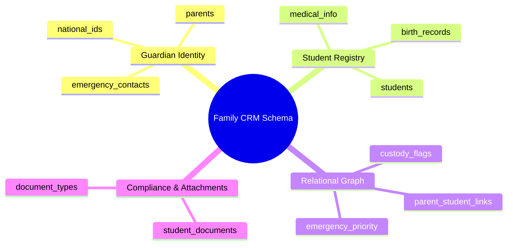

# 08.3 CRM, Students, and Family Relationships Schema

#database #schema #postgres #crm #students #parents #family #relationships #chapter8

This document details the database schema, relational ties, document attachments, and family graph data models that govern Parents, Legal Guardians, Students, and Enrollment profiles in the El-Imtiyaz platform.

---

## 1. Family CRM Conceptual Mind Map



---

## 2. Table Specifications and DDL Definitions

### 2.1 `parents`
Stores guardian identity, professional details, contact parameters, and portal linking identifiers.

```sql
CREATE TABLE public.parents (
    id UUID PRIMARY KEY DEFAULT gen_random_uuid(),
    tenant_id UUID NOT NULL REFERENCES public.tenants(id) ON DELETE CASCADE,
    user_id UUID UNIQUE REFERENCES public.user_profiles(id) ON DELETE SET NULL,
    first_name VARCHAR(100) NOT NULL,
    last_name VARCHAR(100) NOT NULL,
    full_name VARCHAR(200) GENERATED ALWAYS AS (first_name || ' ' || last_name) STORED,
    phone_primary VARCHAR(50) NOT NULL,
    phone_secondary VARCHAR(50),
    email VARCHAR(255),
    profession VARCHAR(150),
    national_id VARCHAR(50),
    address TEXT,
    city VARCHAR(100),
    notes TEXT,
    is_emergency_contact BOOLEAN DEFAULT TRUE,
    created_at TIMESTAMPTZ NOT NULL DEFAULT clock_timestamp(),
    updated_at TIMESTAMPTZ NOT NULL DEFAULT clock_timestamp(),
    deleted_at TIMESTAMPTZ,
    CONSTRAINT uq_tenant_parent_phone UNIQUE (tenant_id, phone_primary)
);

CREATE INDEX idx_parents_tenant ON public.parents(tenant_id) WHERE deleted_at IS NULL;
CREATE INDEX idx_parents_name ON public.parents(tenant_id, last_name, first_name);
```

---

### 2.2 `students`
The core student identity entity containing demographic information, matriculation numbers, emergency medical profiles, and current enrollment state.

```sql
CREATE TABLE public.students (
    id UUID PRIMARY KEY DEFAULT gen_random_uuid(),
    tenant_id UUID NOT NULL REFERENCES public.tenants(id) ON DELETE CASCADE,
    registration_number VARCHAR(50) NOT NULL, -- Unique matricule within tenant
    first_name VARCHAR(100) NOT NULL,
    last_name VARCHAR(100) NOT NULL,
    full_name VARCHAR(200) GENERATED ALWAYS AS (first_name || ' ' || last_name) STORED,
    gender VARCHAR(10) NOT NULL CHECK (gender IN ('MALE', 'FEMALE')),
    date_of_birth DATE NOT NULL,
    place_of_birth VARCHAR(150),
    national_student_id VARCHAR(50),
    avatar_url TEXT,
    current_class_id UUID REFERENCES public.classes(id) ON DELETE SET NULL,
    blood_group VARCHAR(5) CHECK (blood_group IN ('A+', 'A-', 'B+', 'B-', 'AB+', 'AB-', 'O+', 'O-')),
    medical_allergies TEXT,
    medical_notes TEXT,
    status VARCHAR(30) DEFAULT 'ACTIVE' CHECK (status IN ('ACTIVE', 'REGISTERED', 'GRADUATED', 'TRANSFERRED', 'EXPELLED', 'SUSPENDED')),
    transport_subscribed BOOLEAN DEFAULT FALSE,
    canteen_subscribed BOOLEAN DEFAULT FALSE,
    created_at TIMESTAMPTZ NOT NULL DEFAULT clock_timestamp(),
    updated_at TIMESTAMPTZ NOT NULL DEFAULT clock_timestamp(),
    deleted_at TIMESTAMPTZ,
    CONSTRAINT uq_tenant_student_reg UNIQUE (tenant_id, registration_number)
);

CREATE INDEX idx_students_tenant_class ON public.students(tenant_id, current_class_id) WHERE deleted_at IS NULL;
CREATE INDEX idx_students_status ON public.students(tenant_id, status);
CREATE INDEX idx_students_name ON public.students(tenant_id, last_name, first_name);
```

---

### 2.3 `parent_student_links`
The many-to-many junction entity mapping complex family ties, relationship types, legal custody rights, and financial responsibility flags.

```sql
CREATE TABLE public.parent_student_links (
    id UUID PRIMARY KEY DEFAULT gen_random_uuid(),
    tenant_id UUID NOT NULL REFERENCES public.tenants(id) ON DELETE CASCADE,
    parent_id UUID NOT NULL REFERENCES public.parents(id) ON DELETE CASCADE,
    student_id UUID NOT NULL REFERENCES public.students(id) ON DELETE CASCADE,
    relationship_type VARCHAR(30) NOT NULL CHECK (relationship_type IN ('FATHER', 'MOTHER', 'LEGAL_GUARDIAN', 'UNCLE', 'AUNT', 'GRANDPARENT', 'OTHER')),
    is_primary_contact BOOLEAN DEFAULT FALSE,
    is_financially_responsible BOOLEAN DEFAULT FALSE,
    has_custody BOOLEAN DEFAULT TRUE,
    can_pickup BOOLEAN DEFAULT TRUE,
    created_at TIMESTAMPTZ NOT NULL DEFAULT clock_timestamp(),
    CONSTRAINT uq_parent_student_link UNIQUE (parent_id, student_id)
);

CREATE INDEX idx_parent_student_parent ON public.parent_student_links(parent_id);
CREATE INDEX idx_parent_student_student ON public.parent_student_links(student_id);
```

---

### 2.4 `student_documents`
Tracks official identity and academic files attached to student profiles (birth certificates, medical forms, vaccination cards, previous school transcripts).

```sql
CREATE TABLE public.student_documents (
    id UUID PRIMARY KEY DEFAULT gen_random_uuid(),
    tenant_id UUID NOT NULL REFERENCES public.tenants(id) ON DELETE CASCADE,
    student_id UUID NOT NULL REFERENCES public.students(id) ON DELETE CASCADE,
    title VARCHAR(150) NOT NULL,
    document_type VARCHAR(50) NOT NULL CHECK (document_type IN ('BIRTH_CERTIFICATE', 'MEDICAL_CERTIFICATE', 'VACCINATION_CARD', 'PREVIOUS_REPORT_CARD', 'IDENTITY_PHOTO', 'LEGAL_CUSTODY_DOC', 'OTHER')),
    file_path TEXT NOT NULL,
    file_size_bytes BIGINT,
    mime_type VARCHAR(100),
    uploaded_by UUID REFERENCES public.user_profiles(id),
    created_at TIMESTAMPTZ NOT NULL DEFAULT clock_timestamp()
);

CREATE INDEX idx_student_documents_student ON public.student_documents(tenant_id, student_id);
```

---

## 3. Related System Documentation

- [[05.1 Academic Structure, Curriculum, and Timetable Management]]
- [[08.2 Academic Structure, Classes, and Grading Schema]]
- [[08.4 Financial Engine, Tariffs, Invoices, and Ledger Schema]]
- [[08. Master Database Schema MOC]]
