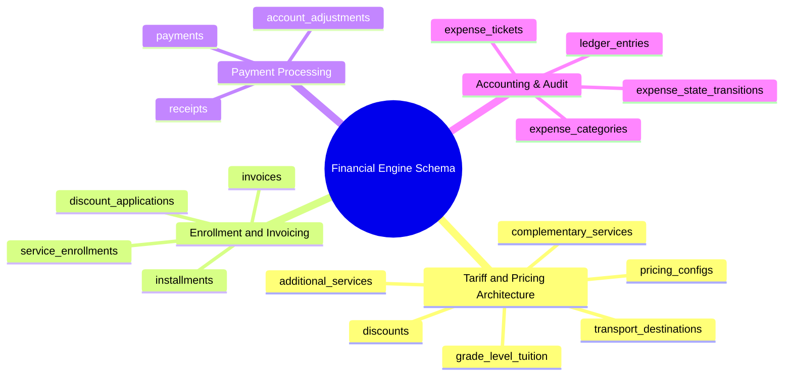

# 08.4 Financial Engine, Tariffs, Invoices, and Ledger Schema

#database #schema #postgres #financial #ledger #tariffs #invoices #accounting #payments #chapter8

This document details the database schema, financial calculation integrity rules, immutable double-entry ledger structures, and tuition tariff models in the El-Imtiyaz School Management System.

---

## 1. Financial Schema Conceptual Mind Map



---

## 2. Table Specifications and DDL Definitions

### 2.1 `pricing_configs`, `grade_level_tuition`, and `transport_destinations`

```sql
CREATE TABLE public.pricing_configs (
    id UUID PRIMARY KEY DEFAULT gen_random_uuid(),
    tenant_id UUID NOT NULL REFERENCES public.tenants(id) ON DELETE CASCADE,
    academic_year_id UUID NOT NULL REFERENCES public.academic_years(id) ON DELETE RESTRICT,
    title VARCHAR(150) NOT NULL,
    currency VARCHAR(3) DEFAULT 'DZD',
    is_active BOOLEAN DEFAULT TRUE,
    created_at TIMESTAMPTZ NOT NULL DEFAULT clock_timestamp(),
    CONSTRAINT uq_tenant_year_pricing UNIQUE (tenant_id, academic_year_id)
);

CREATE TABLE public.grade_level_tuition (
    id UUID PRIMARY KEY DEFAULT gen_random_uuid(),
    tenant_id UUID NOT NULL REFERENCES public.tenants(id) ON DELETE CASCADE,
    pricing_config_id UUID NOT NULL REFERENCES public.pricing_configs(id) ON DELETE CASCADE,
    academic_level_id UUID NOT NULL REFERENCES public.academic_levels(id) ON DELETE CASCADE,
    annual_tuition_centimes BIGINT NOT NULL CHECK (annual_tuition_centimes >= 0),
    registration_fee_centimes BIGINT NOT NULL DEFAULT 0 CHECK (registration_fee_centimes >= 0),
    re_registration_fee_centimes BIGINT NOT NULL DEFAULT 0 CHECK (re_registration_fee_centimes >= 0),
    created_at TIMESTAMPTZ NOT NULL DEFAULT clock_timestamp(),
    CONSTRAINT uq_pricing_grade_level UNIQUE (pricing_config_id, academic_level_id)
);

CREATE TABLE public.transport_destinations (
    id UUID PRIMARY KEY DEFAULT gen_random_uuid(),
    tenant_id UUID NOT NULL REFERENCES public.tenants(id) ON DELETE CASCADE,
    pricing_config_id UUID NOT NULL REFERENCES public.pricing_configs(id) ON DELETE CASCADE,
    zone_name VARCHAR(100) NOT NULL,
    monthly_fee_centimes BIGINT NOT NULL CHECK (monthly_fee_centimes >= 0),
    annual_fee_centimes BIGINT NOT NULL CHECK (annual_fee_centimes >= 0),
    created_at TIMESTAMPTZ NOT NULL DEFAULT clock_timestamp()
);
```

---

### 2.2 `complementary_services`, `additional_services`, and `discounts`

```sql
CREATE TABLE public.complementary_services (
    id UUID PRIMARY KEY DEFAULT gen_random_uuid(),
    tenant_id UUID NOT NULL REFERENCES public.tenants(id) ON DELETE CASCADE,
    pricing_config_id UUID NOT NULL REFERENCES public.pricing_configs(id) ON DELETE CASCADE,
    service_name VARCHAR(100) NOT NULL, -- e.g., 'Canteen', 'After-School Care', 'Study Club'
    billing_period VARCHAR(20) NOT NULL CHECK (billing_period IN ('MONTHLY', 'TRIMESTER', 'ANNUAL', 'PER_USE')),
    fee_centimes BIGINT NOT NULL CHECK (fee_centimes >= 0),
    created_at TIMESTAMPTZ NOT NULL DEFAULT clock_timestamp()
);

CREATE TABLE public.additional_services (
    id UUID PRIMARY KEY DEFAULT gen_random_uuid(),
    tenant_id UUID NOT NULL REFERENCES public.tenants(id) ON DELETE CASCADE,
    pricing_config_id UUID NOT NULL REFERENCES public.pricing_configs(id) ON DELETE CASCADE,
    service_name VARCHAR(100) NOT NULL, -- e.g., 'Uniform Kit', 'Book Pack', 'Robotics Lab'
    unit_price_centimes BIGINT NOT NULL CHECK (unit_price_centimes >= 0),
    created_at TIMESTAMPTZ NOT NULL DEFAULT clock_timestamp()
);

CREATE TABLE public.discounts (
    id UUID PRIMARY KEY DEFAULT gen_random_uuid(),
    tenant_id UUID NOT NULL REFERENCES public.tenants(id) ON DELETE CASCADE,
    pricing_config_id UUID NOT NULL REFERENCES public.pricing_configs(id) ON DELETE CASCADE,
    name VARCHAR(100) NOT NULL, -- e.g., 'Sibling 2nd Child', 'Staff Child', 'Academic Excellence'
    discount_type VARCHAR(20) NOT NULL CHECK (discount_type IN ('PERCENTAGE', 'FIXED_AMOUNT')),
    percentage_value NUMERIC(5,2) CHECK (percentage_value >= 0 AND percentage_value <= 100),
    fixed_centimes BIGINT CHECK (fixed_centimes >= 0),
    applies_to VARCHAR(30) NOT NULL CHECK (applies_to IN ('TUITION_ONLY', 'TRANSPORT_ONLY', 'TOTAL_BILL')),
    created_at TIMESTAMPTZ NOT NULL DEFAULT clock_timestamp()
);
```

---

### 2.3 `service_enrollments` and `discount_applications`

```sql
CREATE TABLE public.service_enrollments (
    id UUID PRIMARY KEY DEFAULT gen_random_uuid(),
    tenant_id UUID NOT NULL REFERENCES public.tenants(id) ON DELETE CASCADE,
    student_id UUID NOT NULL REFERENCES public.students(id) ON DELETE CASCADE,
    academic_year_id UUID NOT NULL REFERENCES public.academic_years(id) ON DELETE RESTRICT,
    service_type VARCHAR(50) NOT NULL CHECK (service_type IN ('TUITION', 'TRANSPORT', 'CANTEEN', 'COMPLEMENTARY', 'ADDITIONAL')),
    service_reference_id UUID, -- Polymorphic reference to transport_destinations, complementary_services, etc.
    start_date DATE NOT NULL,
    end_date DATE,
    custom_fee_centimes BIGINT, -- Override if non-standard fee agreed
    is_active BOOLEAN DEFAULT TRUE,
    created_at TIMESTAMPTZ NOT NULL DEFAULT clock_timestamp()
);

CREATE TABLE public.discount_applications (
    id UUID PRIMARY KEY DEFAULT gen_random_uuid(),
    tenant_id UUID NOT NULL REFERENCES public.tenants(id) ON DELETE CASCADE,
    student_id UUID NOT NULL REFERENCES public.students(id) ON DELETE CASCADE,
    discount_id UUID NOT NULL REFERENCES public.discounts(id) ON DELETE CASCADE,
    academic_year_id UUID NOT NULL REFERENCES public.academic_years(id) ON DELETE RESTRICT,
    authorized_by UUID REFERENCES public.user_profiles(id),
    created_at TIMESTAMPTZ NOT NULL DEFAULT clock_timestamp(),
    CONSTRAINT uq_student_year_discount UNIQUE (student_id, discount_id, academic_year_id)
);
```

---

### 2.4 `invoices`, `installments`, `payments`, and `receipts`

```sql
CREATE TABLE public.invoices (
    id UUID PRIMARY KEY DEFAULT gen_random_uuid(),
    tenant_id UUID NOT NULL REFERENCES public.tenants(id) ON DELETE CASCADE,
    student_id UUID NOT NULL REFERENCES public.students(id) ON DELETE CASCADE,
    academic_year_id UUID NOT NULL REFERENCES public.academic_years(id) ON DELETE RESTRICT,
    invoice_number VARCHAR(50) NOT NULL,
    issue_date DATE NOT NULL,
    due_date DATE NOT NULL,
    gross_amount_centimes BIGINT NOT NULL CHECK (gross_amount_centimes >= 0),
    discount_amount_centimes BIGINT NOT NULL DEFAULT 0 CHECK (discount_amount_centimes >= 0),
    net_amount_centimes BIGINT NOT NULL CHECK (net_amount_centimes >= 0),
    paid_amount_centimes BIGINT NOT NULL DEFAULT 0 CHECK (paid_amount_centimes >= 0),
    balance_due_centimes BIGINT GENERATED ALWAYS AS (net_amount_centimes - paid_amount_centimes) STORED,
    status VARCHAR(30) DEFAULT 'ISSUED' CHECK (status IN ('DRAFT', 'ISSUED', 'PARTIALLY_PAID', 'PAID', 'OVERDUE', 'CANCELLED')),
    created_at TIMESTAMPTZ NOT NULL DEFAULT clock_timestamp(),
    updated_at TIMESTAMPTZ NOT NULL DEFAULT clock_timestamp(),
    CONSTRAINT uq_tenant_invoice_num UNIQUE (tenant_id, invoice_number)
);

CREATE TABLE public.installments (
    id UUID PRIMARY KEY DEFAULT gen_random_uuid(),
    tenant_id UUID NOT NULL REFERENCES public.tenants(id) ON DELETE CASCADE,
    invoice_id UUID NOT NULL REFERENCES public.invoices(id) ON DELETE CASCADE,
    installment_number INT NOT NULL,
    due_date DATE NOT NULL,
    amount_centimes BIGINT NOT NULL CHECK (amount_centimes > 0),
    paid_amount_centimes BIGINT NOT NULL DEFAULT 0 CHECK (paid_amount_centimes >= 0),
    status VARCHAR(30) DEFAULT 'PENDING' CHECK (status IN ('PENDING', 'PARTIAL', 'PAID', 'OVERDUE')),
    created_at TIMESTAMPTZ NOT NULL DEFAULT clock_timestamp(),
    CONSTRAINT uq_invoice_installment UNIQUE (invoice_id, installment_number)
);

CREATE TABLE public.payments (
    id UUID PRIMARY KEY DEFAULT gen_random_uuid(),
    tenant_id UUID NOT NULL REFERENCES public.tenants(id) ON DELETE CASCADE,
    invoice_id UUID REFERENCES public.invoices(id) ON DELETE SET NULL,
    student_id UUID NOT NULL REFERENCES public.students(id) ON DELETE RESTRICT,
    payer_parent_id UUID REFERENCES public.parents(id) ON DELETE SET NULL,
    amount_centimes BIGINT NOT NULL CHECK (amount_centimes > 0),
    payment_method VARCHAR(30) NOT NULL CHECK (payment_method IN ('CASH', 'CHECK', 'BANK_TRANSFER', 'CCP_TRANSFER', 'ONLINE_CARD')),
    reference_number VARCHAR(100),
    payment_date DATE NOT NULL,
    collected_by UUID REFERENCES public.user_profiles(id),
    status VARCHAR(30) DEFAULT 'CONFIRMED' CHECK (status IN ('PENDING', 'CONFIRMED', 'REJECTED', 'REFUNDED')),
    idempotency_key VARCHAR(100) UNIQUE,
    created_at TIMESTAMPTZ NOT NULL DEFAULT clock_timestamp()
);

CREATE TABLE public.receipts (
    id UUID PRIMARY KEY DEFAULT gen_random_uuid(),
    tenant_id UUID NOT NULL REFERENCES public.tenants(id) ON DELETE CASCADE,
    payment_id UUID NOT NULL UNIQUE REFERENCES public.payments(id) ON DELETE CASCADE,
    receipt_number VARCHAR(50) NOT NULL,
    issued_date TIMESTAMPTZ NOT NULL DEFAULT clock_timestamp(),
    pdf_url TEXT,
    CONSTRAINT uq_tenant_receipt_num UNIQUE (tenant_id, receipt_number)
);
```

---

### 2.5 `ledger_entries` and Expense Subsystem

```sql
CREATE TABLE public.ledger_entries (
    id UUID PRIMARY KEY DEFAULT gen_random_uuid(),
    tenant_id UUID NOT NULL REFERENCES public.tenants(id) ON DELETE CASCADE,
    entry_number BIGSERIAL,
    transaction_date DATE NOT NULL,
    account_code VARCHAR(50) NOT NULL,
    entry_type VARCHAR(10) NOT NULL CHECK (entry_type IN ('DEBIT', 'CREDIT')),
    amount_centimes BIGINT NOT NULL CHECK (amount_centimes > 0),
    currency VARCHAR(3) DEFAULT 'DZD',
    source_document_type VARCHAR(50) NOT NULL, -- e.g., 'PAYMENT', 'EXPENSE_TICKET', 'ADJUSTMENT'
    source_document_id UUID NOT NULL,
    description TEXT NOT NULL,
    recorded_by UUID REFERENCES public.user_profiles(id),
    created_at TIMESTAMPTZ NOT NULL DEFAULT clock_timestamp()
);

CREATE TABLE public.expense_categories (
    id UUID PRIMARY KEY DEFAULT gen_random_uuid(),
    tenant_id UUID NOT NULL REFERENCES public.tenants(id) ON DELETE CASCADE,
    code VARCHAR(50) NOT NULL,
    name VARCHAR(100) NOT NULL,
    budget_limit_centimes BIGINT DEFAULT 0,
    created_at TIMESTAMPTZ NOT NULL DEFAULT clock_timestamp(),
    CONSTRAINT uq_tenant_expense_category UNIQUE (tenant_id, code)
);

CREATE TABLE public.expense_tickets (
    id UUID PRIMARY KEY DEFAULT gen_random_uuid(),
    tenant_id UUID NOT NULL REFERENCES public.tenants(id) ON DELETE CASCADE,
    category_id UUID NOT NULL REFERENCES public.expense_categories(id) ON DELETE RESTRICT,
    ticket_number VARCHAR(50) NOT NULL,
    title VARCHAR(150) NOT NULL,
    amount_centimes BIGINT NOT NULL CHECK (amount_centimes > 0),
    payment_method VARCHAR(30) NOT NULL CHECK (payment_method IN ('CASH', 'CHECK', 'BANK_TRANSFER')),
    beneficiary_name VARCHAR(150) NOT NULL,
    receipt_attachment_url TEXT,
    current_state VARCHAR(30) DEFAULT 'SUBMITTED' CHECK (current_state IN ('DRAFT', 'SUBMITTED', 'VERIFIED', 'APPROVED', 'DISBURSED', 'REJECTED')),
    requested_by UUID NOT NULL REFERENCES public.user_profiles(id),
    created_at TIMESTAMPTZ NOT NULL DEFAULT clock_timestamp(),
    updated_at TIMESTAMPTZ NOT NULL DEFAULT clock_timestamp(),
    CONSTRAINT uq_tenant_expense_ticket UNIQUE (tenant_id, ticket_number)
);

CREATE TABLE public.expense_state_transitions (
    id UUID PRIMARY KEY DEFAULT gen_random_uuid(),
    ticket_id UUID NOT NULL REFERENCES public.expense_tickets(id) ON DELETE CASCADE,
    from_state VARCHAR(30) NOT NULL,
    to_state VARCHAR(30) NOT NULL,
    action_by UUID NOT NULL REFERENCES public.user_profiles(id),
    notes TEXT,
    transitioned_at TIMESTAMPTZ NOT NULL DEFAULT clock_timestamp()
);
```

---

## 3. Related System Documentation

- [[03.1 Financial Engine, Tariffs, and Pricing Configurations]]
- [[03.2 Invoicing, Installment Plans, and Payment Lifecycles]]
- [[03.3 Immutable General Ledger and Expense Management]]
- [[08. Master Database Schema MOC]]
