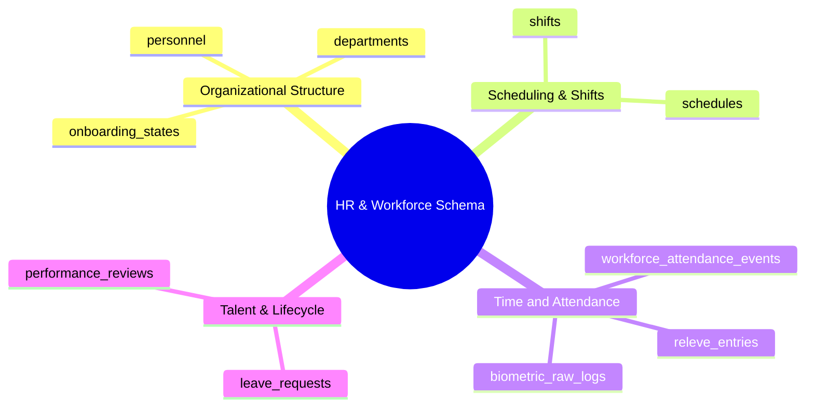

# 08.5 HR, Workforce Attendance, Releve, and Shifts Schema

#database #schema #postgres #hr #workforce #attendance #shifts #releve #payroll #chapter8

This document details the database schema, relational ties, scheduling configurations, biometrics/relevé logging, and leave management structures for the HR and Workforce subsystem.

---

## 1. HR & Workforce Conceptual Mind Map



---

## 2. Table Specifications and DDL Definitions

### 2.1 `departments` and `personnel`

```sql
CREATE TABLE public.departments (
    id UUID PRIMARY KEY DEFAULT gen_random_uuid(),
    tenant_id UUID NOT NULL REFERENCES public.tenants(id) ON DELETE CASCADE,
    name VARCHAR(100) NOT NULL,
    code VARCHAR(30) NOT NULL,
    manager_id UUID, -- self-referential or user_profiles
    created_at TIMESTAMPTZ NOT NULL DEFAULT clock_timestamp(),
    CONSTRAINT uq_tenant_dept_code UNIQUE (tenant_id, code)
);

CREATE TABLE public.personnel (
    id UUID PRIMARY KEY DEFAULT gen_random_uuid(),
    tenant_id UUID NOT NULL REFERENCES public.tenants(id) ON DELETE CASCADE,
    user_id UUID UNIQUE REFERENCES public.user_profiles(id) ON DELETE SET NULL,
    department_id UUID REFERENCES public.departments(id) ON DELETE SET NULL,
    employee_number VARCHAR(50) NOT NULL,
    job_title VARCHAR(100) NOT NULL,
    contract_type VARCHAR(30) NOT NULL CHECK (contract_type IN ('CDI', 'CDD', 'HOURLY', 'INTERN', 'CONSULTANT')),
    employment_status VARCHAR(30) DEFAULT 'ACTIVE' CHECK (employment_status IN ('ACTIVE', 'ON_LEAVE', 'PROBATION', 'TERMINATED', 'RESIGNED')),
    hire_date DATE NOT NULL,
    termination_date DATE,
    base_salary_centimes BIGINT DEFAULT 0 CHECK (base_salary_centimes >= 0),
    hourly_rate_centimes BIGINT DEFAULT 0 CHECK (hourly_rate_centimes >= 0),
    bank_account_iban VARCHAR(50),
    social_security_number VARCHAR(50),
    created_at TIMESTAMPTZ NOT NULL DEFAULT clock_timestamp(),
    updated_at TIMESTAMPTZ NOT NULL DEFAULT clock_timestamp(),
    deleted_at TIMESTAMPTZ,
    CONSTRAINT uq_tenant_employee_num UNIQUE (tenant_id, employee_number)
);

CREATE INDEX idx_personnel_tenant_dept ON public.personnel(tenant_id, department_id) WHERE deleted_at IS NULL;
```

---

### 2.2 `shifts` and `schedules`

```sql
CREATE TABLE public.shifts (
    id UUID PRIMARY KEY DEFAULT gen_random_uuid(),
    tenant_id UUID NOT NULL REFERENCES public.tenants(id) ON DELETE CASCADE,
    name VARCHAR(100) NOT NULL, -- e.g., 'Morning Shift', 'Administrative Full Day'
    start_time TIME NOT NULL,
    end_time TIME NOT NULL,
    grace_period_minutes INT DEFAULT 15,
    is_overnight BOOLEAN DEFAULT FALSE,
    created_at TIMESTAMPTZ NOT NULL DEFAULT clock_timestamp()
);

CREATE TABLE public.schedules (
    id UUID PRIMARY KEY DEFAULT gen_random_uuid(),
    tenant_id UUID NOT NULL REFERENCES public.tenants(id) ON DELETE CASCADE,
    personnel_id UUID NOT NULL REFERENCES public.personnel(id) ON DELETE CASCADE,
    shift_id UUID NOT NULL REFERENCES public.shifts(id) ON DELETE RESTRICT,
    day_of_week INT NOT NULL CHECK (day_of_week BETWEEN 1 AND 7), -- 1 = Sunday / Monday depending on locale
    effective_start DATE NOT NULL,
    effective_end DATE,
    created_at TIMESTAMPTZ NOT NULL DEFAULT clock_timestamp()
);
```

---

### 2.3 `workforce_attendance_events` and `releve_entries`

```sql
CREATE TABLE public.workforce_attendance_events (
    id UUID PRIMARY KEY DEFAULT gen_random_uuid(),
    tenant_id UUID NOT NULL REFERENCES public.tenants(id) ON DELETE CASCADE,
    personnel_id UUID NOT NULL REFERENCES public.personnel(id) ON DELETE CASCADE,
    event_timestamp TIMESTAMPTZ NOT NULL DEFAULT clock_timestamp(),
    event_type VARCHAR(20) NOT NULL CHECK (event_type IN ('CHECK_IN', 'CHECK_OUT', 'BREAK_START', 'BREAK_END')),
    source VARCHAR(30) DEFAULT 'BIOMETRIC' CHECK (source IN ('BIOMETRIC', 'RFID_CARD', 'MOBILE_APP', 'MANUAL_ENTRY')),
    device_identifier VARCHAR(100),
    geo_latitude NUMERIC(10,8),
    geo_longitude NUMERIC(11,8),
    is_flagged_late BOOLEAN DEFAULT FALSE,
    created_at TIMESTAMPTZ NOT NULL DEFAULT clock_timestamp()
);

CREATE TABLE public.releve_entries (
    id UUID PRIMARY KEY DEFAULT gen_random_uuid(),
    tenant_id UUID NOT NULL REFERENCES public.tenants(id) ON DELETE CASCADE,
    personnel_id UUID NOT NULL REFERENCES public.personnel(id) ON DELETE CASCADE,
    releve_date DATE NOT NULL,
    first_check_in TIMESTAMPTZ,
    last_check_out TIMESTAMPTZ,
    planned_minutes INT NOT NULL DEFAULT 480,
    worked_minutes INT NOT NULL DEFAULT 0,
    overtime_minutes INT NOT NULL DEFAULT 0,
    late_minutes INT NOT NULL DEFAULT 0,
    early_departure_minutes INT NOT NULL DEFAULT 0,
    status VARCHAR(30) DEFAULT 'REGULAR' CHECK (status IN ('REGULAR', 'LATE', 'ABSENT', 'ON_LEAVE', 'HOLIDAY', 'WEEKEND', 'EXCUSED')),
    is_approved BOOLEAN DEFAULT FALSE,
    approved_by UUID REFERENCES public.user_profiles(id),
    created_at TIMESTAMPTZ NOT NULL DEFAULT clock_timestamp(),
    CONSTRAINT uq_personnel_daily_releve UNIQUE (personnel_id, releve_date)
);

CREATE INDEX idx_releve_personnel_date ON public.releve_entries(tenant_id, personnel_id, releve_date);
```

---

### 2.4 `leave_requests`, `performance_reviews`, and `onboarding_states`

```sql
CREATE TABLE public.leave_requests (
    id UUID PRIMARY KEY DEFAULT gen_random_uuid(),
    tenant_id UUID NOT NULL REFERENCES public.tenants(id) ON DELETE CASCADE,
    personnel_id UUID NOT NULL REFERENCES public.personnel(id) ON DELETE CASCADE,
    leave_type VARCHAR(30) NOT NULL CHECK (leave_type IN ('ANNUAL', 'SICK', 'MATERNITY', 'PATERNITY', 'UNPAID', 'BEREAVEMENT', 'SPECIAL')),
    start_date DATE NOT NULL,
    end_date DATE NOT NULL,
    total_days NUMERIC(4,1) NOT NULL,
    reason TEXT,
    medical_certificate_url TEXT,
    status VARCHAR(30) DEFAULT 'PENDING' CHECK (status IN ('PENDING', 'APPROVED', 'REJECTED', 'CANCELLED')),
    reviewed_by UUID REFERENCES public.user_profiles(id),
    reviewed_at TIMESTAMPTZ,
    rejection_reason TEXT,
    created_at TIMESTAMPTZ NOT NULL DEFAULT clock_timestamp(),
    CONSTRAINT chk_leave_dates CHECK (end_date >= start_date)
);

CREATE TABLE public.performance_reviews (
    id UUID PRIMARY KEY DEFAULT gen_random_uuid(),
    tenant_id UUID NOT NULL REFERENCES public.tenants(id) ON DELETE CASCADE,
    personnel_id UUID NOT NULL REFERENCES public.personnel(id) ON DELETE CASCADE,
    reviewer_id UUID NOT NULL REFERENCES public.user_profiles(id),
    review_period VARCHAR(50) NOT NULL, -- e.g., 'Q1-2025', 'Annual-2024'
    rating_score NUMERIC(3,2) CHECK (rating_score BETWEEN 1.0 AND 5.0),
    goals_met_score NUMERIC(3,2),
    strengths TEXT,
    areas_for_improvement TEXT,
    comments TEXT,
    conducted_date DATE NOT NULL,
    created_at TIMESTAMPTZ NOT NULL DEFAULT clock_timestamp()
);

CREATE TABLE public.onboarding_states (
    id UUID PRIMARY KEY DEFAULT gen_random_uuid(),
    tenant_id UUID NOT NULL REFERENCES public.tenants(id) ON DELETE CASCADE,
    personnel_id UUID NOT NULL UNIQUE REFERENCES public.personnel(id) ON DELETE CASCADE,
    stage VARCHAR(50) NOT NULL DEFAULT 'DOCUMENTATION_COLLECTION',
    completed_steps JSONB DEFAULT '[]'::jsonb,
    is_completed BOOLEAN DEFAULT FALSE,
    completed_at TIMESTAMPTZ,
    created_at TIMESTAMPTZ NOT NULL DEFAULT clock_timestamp()
);
```

---

## 3. Related System Documentation

- [[08.1 Core Multi-Tenancy, Users, and RBAC Schema]]
- [[08.4 Financial Engine, Tariffs, Invoices, and Ledger Schema]]
- [[08. Master Database Schema MOC]]
