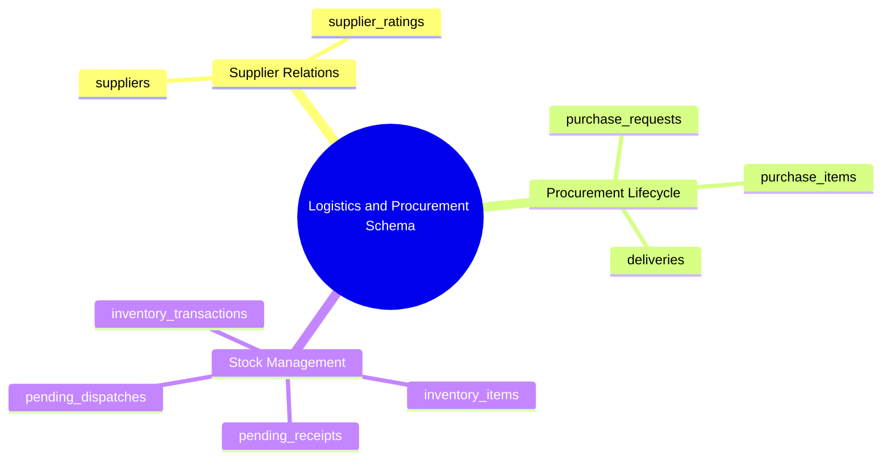

# 08.6 Logistics, Inventory, Procurement, and Suppliers Schema

#database #schema #postgres #logistics #inventory #procurement #suppliers #stock #chapter8

This document details the relational database schema, transactional stock management, supplier records, purchase request flows, and delivery route tracking models for the Logistics and Procurement engine.

---

## 1. Logistics & Procurement Conceptual Mind Map



---

## 2. Table Specifications and DDL Definitions

### 2.1 `suppliers` and `purchase_requests`

```sql
CREATE TABLE public.suppliers (
    id UUID PRIMARY KEY DEFAULT gen_random_uuid(),
    tenant_id UUID NOT NULL REFERENCES public.tenants(id) ON DELETE CASCADE,
    company_name VARCHAR(150) NOT NULL,
    contact_person VARCHAR(100),
    phone VARCHAR(50) NOT NULL,
    email VARCHAR(255),
    tax_id VARCHAR(50),
    trade_register_number VARCHAR(50),
    address TEXT,
    city VARCHAR(100),
    category VARCHAR(50) NOT NULL, -- e.g., 'STATIONERY', 'FOOD_SUPPLIES', 'IT_EQUIPMENT', 'MAINTENANCE'
    rating NUMERIC(3,2) CHECK (rating BETWEEN 1.0 AND 5.0),
    status VARCHAR(30) DEFAULT 'ACTIVE' CHECK (status IN ('ACTIVE', 'INACTIVE', 'BLACKLISTED')),
    created_at TIMESTAMPTZ NOT NULL DEFAULT clock_timestamp(),
    updated_at TIMESTAMPTZ NOT NULL DEFAULT clock_timestamp()
);

CREATE TABLE public.purchase_requests (
    id UUID PRIMARY KEY DEFAULT gen_random_uuid(),
    tenant_id UUID NOT NULL REFERENCES public.tenants(id) ON DELETE CASCADE,
    request_number VARCHAR(50) NOT NULL,
    requested_by UUID NOT NULL REFERENCES public.user_profiles(id),
    department_id UUID REFERENCES public.departments(id),
    supplier_id UUID REFERENCES public.suppliers(id) ON DELETE SET NULL,
    title VARCHAR(150) NOT NULL,
    description TEXT,
    estimated_total_centimes BIGINT NOT NULL DEFAULT 0 CHECK (estimated_total_centimes >= 0),
    actual_total_centimes BIGINT DEFAULT 0 CHECK (actual_total_centimes >= 0),
    urgency VARCHAR(20) DEFAULT 'MEDIUM' CHECK (urgency IN ('LOW', 'MEDIUM', 'HIGH', 'EMERGENCY')),
    status VARCHAR(30) DEFAULT 'SUBMITTED' CHECK (status IN ('DRAFT', 'SUBMITTED', 'APPROVED', 'ORDERED', 'PARTIALLY_DELIVERED', 'FULFILLED', 'REJECTED', 'CANCELLED')),
    approved_by UUID REFERENCES public.user_profiles(id),
    approved_at TIMESTAMPTZ,
    created_at TIMESTAMPTZ NOT NULL DEFAULT clock_timestamp(),
    updated_at TIMESTAMPTZ NOT NULL DEFAULT clock_timestamp(),
    CONSTRAINT uq_tenant_purchase_req UNIQUE (tenant_id, request_number)
);
```

---

### 2.2 `deliveries` and `inventory_items`

```sql
CREATE TABLE public.deliveries (
    id UUID PRIMARY KEY DEFAULT gen_random_uuid(),
    tenant_id UUID NOT NULL REFERENCES public.tenants(id) ON DELETE CASCADE,
    purchase_request_id UUID REFERENCES public.purchase_requests(id) ON DELETE SET NULL,
    delivery_note_number VARCHAR(50),
    delivery_date DATE NOT NULL,
    received_by UUID NOT NULL REFERENCES public.user_profiles(id),
    carrier_name VARCHAR(100),
    tracking_reference VARCHAR(100),
    status VARCHAR(30) DEFAULT 'RECEIVED' CHECK (status IN ('IN_TRANSIT', 'RECEIVED', 'INSPECTED_ACCEPTED', 'DISCREPANCY_FLAGGED', 'RETURNED')),
    inspection_notes TEXT,
    created_at TIMESTAMPTZ NOT NULL DEFAULT clock_timestamp()
);

CREATE TABLE public.inventory_items (
    id UUID PRIMARY KEY DEFAULT gen_random_uuid(),
    tenant_id UUID NOT NULL REFERENCES public.tenants(id) ON DELETE CASCADE,
    sku VARCHAR(50) NOT NULL,
    barcode VARCHAR(100),
    name VARCHAR(150) NOT NULL,
    description TEXT,
    category VARCHAR(50) NOT NULL, -- e.g., 'CLASSROOM_SUPPLIES', 'CANTEEN_INGREDIENTS', 'CLEANING', 'IT_HARDWARE'
    unit_of_measure VARCHAR(30) NOT NULL, -- e.g., 'UNIT', 'BOX', 'KG', 'LITER', 'PACK'
    quantity_on_hand INT NOT NULL DEFAULT 0 CHECK (quantity_on_hand >= 0),
    reorder_threshold INT NOT NULL DEFAULT 10,
    unit_cost_centimes BIGINT DEFAULT 0 CHECK (unit_cost_centimes >= 0),
    storage_location VARCHAR(100), -- e.g., 'Warehouse A / Shelf 3'
    status VARCHAR(30) DEFAULT 'IN_STOCK' CHECK (status IN ('IN_STOCK', 'LOW_STOCK', 'OUT_OF_STOCK', 'DISCONTINUED')),
    created_at TIMESTAMPTZ NOT NULL DEFAULT clock_timestamp(),
    updated_at TIMESTAMPTZ NOT NULL DEFAULT clock_timestamp(),
    CONSTRAINT uq_tenant_inventory_sku UNIQUE (tenant_id, sku)
);

CREATE INDEX idx_inventory_tenant_sku ON public.inventory_items(tenant_id, sku);
CREATE INDEX idx_inventory_stock ON public.inventory_items(tenant_id, quantity_on_hand);
```

---

### 2.3 `inventory_transactions`, `pending_receipts`, and `pending_dispatches`

```sql
CREATE TABLE public.inventory_transactions (
    id UUID PRIMARY KEY DEFAULT gen_random_uuid(),
    tenant_id UUID NOT NULL REFERENCES public.tenants(id) ON DELETE CASCADE,
    item_id UUID NOT NULL REFERENCES public.inventory_items(id) ON DELETE CASCADE,
    transaction_type VARCHAR(30) NOT NULL CHECK (transaction_type IN ('PURCHASE_RECEIPT', 'INTERNAL_DISPATCH', 'RETURN_TO_SUPPLIER', 'INVENTORY_ADJUSTMENT', 'DAMAGE_WRITE_OFF')),
    quantity INT NOT NULL, -- Positive for in, negative for out
    previous_quantity INT NOT NULL,
    new_quantity INT NOT NULL,
    source_document_type VARCHAR(50), -- e.g., 'DELIVERY', 'DEPARTMENT_REQUEST'
    source_document_id UUID,
    performed_by UUID NOT NULL REFERENCES public.user_profiles(id),
    reason TEXT,
    created_at TIMESTAMPTZ NOT NULL DEFAULT clock_timestamp()
);

CREATE TABLE public.pending_receipts (
    id UUID PRIMARY KEY DEFAULT gen_random_uuid(),
    tenant_id UUID NOT NULL REFERENCES public.tenants(id) ON DELETE CASCADE,
    purchase_request_id UUID NOT NULL REFERENCES public.purchase_requests(id) ON DELETE CASCADE,
    item_id UUID NOT NULL REFERENCES public.inventory_items(id) ON DELETE CASCADE,
    expected_quantity INT NOT NULL CHECK (expected_quantity > 0),
    received_quantity INT DEFAULT 0 CHECK (received_quantity >= 0),
    status VARCHAR(30) DEFAULT 'PENDING' CHECK (status IN ('PENDING', 'PARTIALLY_RECEIVED', 'COMPLETED')),
    created_at TIMESTAMPTZ NOT NULL DEFAULT clock_timestamp()
);

CREATE TABLE public.pending_dispatches (
    id UUID PRIMARY KEY DEFAULT gen_random_uuid(),
    tenant_id UUID NOT NULL REFERENCES public.tenants(id) ON DELETE CASCADE,
    department_id UUID NOT NULL REFERENCES public.departments(id) ON DELETE CASCADE,
    item_id UUID NOT NULL REFERENCES public.inventory_items(id) ON DELETE CASCADE,
    requested_quantity INT NOT NULL CHECK (requested_quantity > 0),
    dispatched_quantity INT DEFAULT 0 CHECK (dispatched_quantity >= 0),
    requested_by UUID NOT NULL REFERENCES public.user_profiles(id),
    status VARCHAR(30) DEFAULT 'PENDING' CHECK (status IN ('PENDING', 'APPROVED', 'DISPATCHED', 'REJECTED')),
    created_at TIMESTAMPTZ NOT NULL DEFAULT clock_timestamp()
);
```

---

## 3. Related System Documentation

- [[08.4 Financial Engine, Tariffs, Invoices, and Ledger Schema]]
- [[08.5 HR, Workforce Attendance, Releve, and Shifts Schema]]
- [[08. Master Database Schema MOC]]
