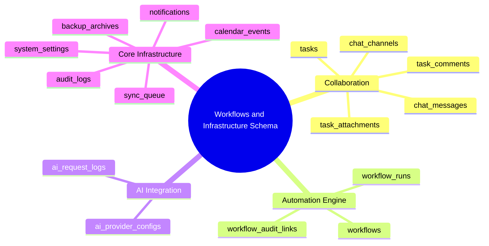

# 08.7 Tasks, Workflows, Chat, AI, and System Infrastructure Schema

#database #schema #postgres #workflows #ai #chat #audit #tasks #sync #chapter8

This document details the database schema, relational ties, and storage structures governing Collaboration Tasks, DAG Workflow Pipelines, Messaging, AI Provider Audits, System Notifications, and Offline Synchronization Queues.

---

## 1. Workflows & Infrastructure Conceptual Mind Map



---

## 2. Table Specifications and DDL Definitions

### 2.1 `tasks`, `task_comments`, and `task_attachments`

```sql
CREATE TABLE public.tasks (
    id UUID PRIMARY KEY DEFAULT gen_random_uuid(),
    tenant_id UUID NOT NULL REFERENCES public.tenants(id) ON DELETE CASCADE,
    title VARCHAR(200) NOT NULL,
    description TEXT,
    priority VARCHAR(20) DEFAULT 'MEDIUM' CHECK (priority IN ('LOW', 'MEDIUM', 'HIGH', 'URGENT')),
    status VARCHAR(30) DEFAULT 'TODO' CHECK (status IN ('TODO', 'IN_PROGRESS', 'REVIEW', 'COMPLETED', 'CANCELLED')),
    assigned_to UUID REFERENCES public.user_profiles(id) ON DELETE SET NULL,
    created_by UUID NOT NULL REFERENCES public.user_profiles(id),
    due_date DATE,
    completed_at TIMESTAMPTZ,
    tags TEXT[] DEFAULT ARRAY[]::TEXT[],
    created_at TIMESTAMPTZ NOT NULL DEFAULT clock_timestamp(),
    updated_at TIMESTAMPTZ NOT NULL DEFAULT clock_timestamp()
);

CREATE TABLE public.task_comments (
    id UUID PRIMARY KEY DEFAULT gen_random_uuid(),
    tenant_id UUID NOT NULL REFERENCES public.tenants(id) ON DELETE CASCADE,
    task_id UUID NOT NULL REFERENCES public.tasks(id) ON DELETE CASCADE,
    author_id UUID NOT NULL REFERENCES public.user_profiles(id),
    comment_text TEXT NOT NULL,
    created_at TIMESTAMPTZ NOT NULL DEFAULT clock_timestamp()
);

CREATE TABLE public.task_attachments (
    id UUID PRIMARY KEY DEFAULT gen_random_uuid(),
    tenant_id UUID NOT NULL REFERENCES public.tenants(id) ON DELETE CASCADE,
    task_id UUID NOT NULL REFERENCES public.tasks(id) ON DELETE CASCADE,
    file_name VARCHAR(255) NOT NULL,
    file_path TEXT NOT NULL,
    file_size_bytes BIGINT,
    mime_type VARCHAR(100),
    uploaded_by UUID NOT NULL REFERENCES public.user_profiles(id),
    created_at TIMESTAMPTZ NOT NULL DEFAULT clock_timestamp()
);
```

---

### 2.2 `workflows`, `workflow_runs`, and `workflow_audit_links`

```sql
CREATE TABLE public.workflows (
    id UUID PRIMARY KEY DEFAULT gen_random_uuid(),
    tenant_id UUID NOT NULL REFERENCES public.tenants(id) ON DELETE CASCADE,
    name VARCHAR(150) NOT NULL,
    trigger_event VARCHAR(100) NOT NULL, -- e.g., 'STUDENT_ENROLLED', 'PAYMENT_RECEIVED', 'GRADE_SUBMITTED'
    dag_definition JSONB NOT NULL, -- Node graph and execution steps
    is_active BOOLEAN DEFAULT TRUE,
    created_by UUID REFERENCES public.user_profiles(id),
    created_at TIMESTAMPTZ NOT NULL DEFAULT clock_timestamp()
);

CREATE TABLE public.workflow_runs (
    id UUID PRIMARY KEY DEFAULT gen_random_uuid(),
    tenant_id UUID NOT NULL REFERENCES public.tenants(id) ON DELETE CASCADE,
    workflow_id UUID NOT NULL REFERENCES public.workflows(id) ON DELETE CASCADE,
    status VARCHAR(30) DEFAULT 'RUNNING' CHECK (status IN ('RUNNING', 'COMPLETED', 'FAILED', 'CANCELLED')),
    context_data JSONB DEFAULT '{}'::jsonb,
    error_message TEXT,
    started_at TIMESTAMPTZ NOT NULL DEFAULT clock_timestamp(),
    finished_at TIMESTAMPTZ
);

CREATE TABLE public.workflow_audit_links (
    id UUID PRIMARY KEY DEFAULT gen_random_uuid(),
    tenant_id UUID NOT NULL REFERENCES public.tenants(id) ON DELETE CASCADE,
    run_id UUID NOT NULL REFERENCES public.workflow_runs(id) ON DELETE CASCADE,
    node_id VARCHAR(100) NOT NULL,
    action_type VARCHAR(50) NOT NULL,
    output_payload JSONB,
    executed_at TIMESTAMPTZ NOT NULL DEFAULT clock_timestamp()
);
```

---

### 2.3 `chat_channels` and `chat_messages`

```sql
CREATE TABLE public.chat_channels (
    id UUID PRIMARY KEY DEFAULT gen_random_uuid(),
    tenant_id UUID NOT NULL REFERENCES public.tenants(id) ON DELETE CASCADE,
    name VARCHAR(100),
    type VARCHAR(30) NOT NULL CHECK (type IN ('DIRECT', 'GROUP', 'CLASS_ROOM', 'STAFF_ROOM', 'ANNOUNCEMENT')),
    created_by UUID REFERENCES public.user_profiles(id),
    created_at TIMESTAMPTZ NOT NULL DEFAULT clock_timestamp()
);

CREATE TABLE public.chat_messages (
    id UUID PRIMARY KEY DEFAULT gen_random_uuid(),
    tenant_id UUID NOT NULL REFERENCES public.tenants(id) ON DELETE CASCADE,
    channel_id UUID NOT NULL REFERENCES public.chat_channels(id) ON DELETE CASCADE,
    sender_id UUID NOT NULL REFERENCES public.user_profiles(id),
    content TEXT NOT NULL,
    attachment_url TEXT,
    is_read BOOLEAN DEFAULT FALSE,
    created_at TIMESTAMPTZ NOT NULL DEFAULT clock_timestamp()
);

CREATE INDEX idx_chat_messages_channel ON public.chat_messages(channel_id, created_at DESC);
```

---

### 2.4 `ai_provider_configs` and `ai_request_logs`

```sql
CREATE TABLE public.ai_provider_configs (
    id UUID PRIMARY KEY DEFAULT gen_random_uuid(),
    tenant_id UUID NOT NULL REFERENCES public.tenants(id) ON DELETE CASCADE,
    provider_name VARCHAR(50) NOT NULL, -- e.g., 'GOOGLE_GEMINI', 'OPENAI', 'ANTHROPIC'
    model_version VARCHAR(50) NOT NULL, -- e.g., 'gemini-1.5-flash', 'gemini-1.5-pro'
    is_enabled BOOLEAN DEFAULT TRUE,
    daily_token_quota INT DEFAULT 500000,
    created_at TIMESTAMPTZ NOT NULL DEFAULT clock_timestamp()
);

CREATE TABLE public.ai_request_logs (
    id UUID PRIMARY KEY DEFAULT gen_random_uuid(),
    tenant_id UUID NOT NULL REFERENCES public.tenants(id) ON DELETE CASCADE,
    user_id UUID REFERENCES public.user_profiles(id),
    feature_context VARCHAR(50) NOT NULL, -- e.g., 'LESSON_PLAN_GEN', 'REPORT_CARD_SUMMARY', 'ASSISTANT_CHAT'
    model_used VARCHAR(50) NOT NULL,
    input_tokens INT NOT NULL DEFAULT 0,
    output_tokens INT NOT NULL DEFAULT 0,
    latency_ms INT,
    status VARCHAR(30) DEFAULT 'SUCCESS' CHECK (status IN ('SUCCESS', 'RATE_LIMITED', 'ERROR', 'FILTERED')),
    error_message TEXT,
    created_at TIMESTAMPTZ NOT NULL DEFAULT clock_timestamp()
);
```

---

### 2.5 System Infrastructure (`calendar_events`, `notifications`, `backup_archives`, `audit_logs`, `system_settings`, `sync_queue`)

```sql
CREATE TABLE public.calendar_events (
    id UUID PRIMARY KEY DEFAULT gen_random_uuid(),
    tenant_id UUID NOT NULL REFERENCES public.tenants(id) ON DELETE CASCADE,
    title VARCHAR(150) NOT NULL,
    description TEXT,
    start_time TIMESTAMPTZ NOT NULL,
    end_time TIMESTAMPTZ NOT NULL,
    event_type VARCHAR(30) NOT NULL CHECK (event_type IN ('EXAM_PERIOD', 'HOLIDAY', 'PARENT_MEETING', 'STAFF_TRAINING', 'EVENT')),
    target_audience VARCHAR(30) DEFAULT 'ALL' CHECK (target_audience IN ('ALL', 'PARENTS', 'TEACHERS', 'STUDENTS', 'ADMIN')),
    created_at TIMESTAMPTZ NOT NULL DEFAULT clock_timestamp()
);

CREATE TABLE public.notifications (
    id UUID PRIMARY KEY DEFAULT gen_random_uuid(),
    tenant_id UUID NOT NULL REFERENCES public.tenants(id) ON DELETE CASCADE,
    recipient_user_id UUID NOT NULL REFERENCES public.user_profiles(id) ON DELETE CASCADE,
    title VARCHAR(150) NOT NULL,
    body TEXT NOT NULL,
    category VARCHAR(50) NOT NULL,
    payload JSONB DEFAULT '{}'::jsonb,
    is_read BOOLEAN DEFAULT FALSE,
    read_at TIMESTAMPTZ,
    created_at TIMESTAMPTZ NOT NULL DEFAULT clock_timestamp()
);

CREATE TABLE public.backup_archives (
    id UUID PRIMARY KEY DEFAULT gen_random_uuid(),
    tenant_id UUID NOT NULL REFERENCES public.tenants(id) ON DELETE CASCADE,
    archive_name VARCHAR(200) NOT NULL,
    storage_path TEXT NOT NULL,
    size_bytes BIGINT NOT NULL,
    checksum VARCHAR(64) NOT NULL,
    encryption_algorithm VARCHAR(30) DEFAULT 'AES-256-GCM',
    status VARCHAR(30) DEFAULT 'VERIFIED' CHECK (status IN ('PENDING', 'VERIFIED', 'FAILED', 'EXPIRED')),
    created_at TIMESTAMPTZ NOT NULL DEFAULT clock_timestamp()
);

CREATE TABLE public.audit_logs (
    id UUID PRIMARY KEY DEFAULT gen_random_uuid(),
    tenant_id UUID NOT NULL REFERENCES public.tenants(id) ON DELETE CASCADE,
    actor_user_id UUID REFERENCES public.user_profiles(id),
    action VARCHAR(100) NOT NULL,
    resource_table VARCHAR(100) NOT NULL,
    resource_id UUID,
    ip_address INET,
    user_agent TEXT,
    old_state JSONB,
    new_state JSONB,
    created_at TIMESTAMPTZ NOT NULL DEFAULT clock_timestamp()
);

CREATE TABLE public.system_settings (
    id UUID PRIMARY KEY DEFAULT gen_random_uuid(),
    tenant_id UUID NOT NULL REFERENCES public.tenants(id) ON DELETE CASCADE,
    setting_key VARCHAR(100) NOT NULL,
    setting_value JSONB NOT NULL,
    is_public BOOLEAN DEFAULT FALSE,
    updated_by UUID REFERENCES public.user_profiles(id),
    updated_at TIMESTAMPTZ NOT NULL DEFAULT clock_timestamp(),
    CONSTRAINT uq_tenant_setting_key UNIQUE (tenant_id, setting_key)
);

CREATE TABLE public.sync_queue (
    id UUID PRIMARY KEY DEFAULT gen_random_uuid(),
    tenant_id UUID NOT NULL REFERENCES public.tenants(id) ON DELETE CASCADE,
    client_mutation_id UUID NOT NULL UNIQUE,
    user_id UUID NOT NULL REFERENCES public.user_profiles(id),
    entity_table VARCHAR(100) NOT NULL,
    operation VARCHAR(20) NOT NULL CHECK (operation IN ('INSERT', 'UPDATE', 'DELETE')),
    payload JSONB NOT NULL,
    server_received_at TIMESTAMPTZ NOT NULL DEFAULT clock_timestamp(),
    processed_at TIMESTAMPTZ,
    status VARCHAR(30) DEFAULT 'APPLIED' CHECK (status IN ('PENDING', 'APPLIED', 'CONFLICT_REJECTED', 'FAILED')),
    error_message TEXT
);

CREATE INDEX idx_audit_logs_tenant_date ON public.audit_logs(tenant_id, created_at DESC);
CREATE INDEX idx_sync_queue_status ON public.sync_queue(tenant_id, status);
```

---

## 3. Related System Documentation

- [[04.1 Bidirectional Sync Engine and Offline Queue Architecture]]
- [[04.2 Conflict Resolution Strategies and Idempotent Mutations]]
- [[08.1 Core Multi-Tenancy, Users, and RBAC Schema]]
- [[08. Master Database Schema MOC]]
